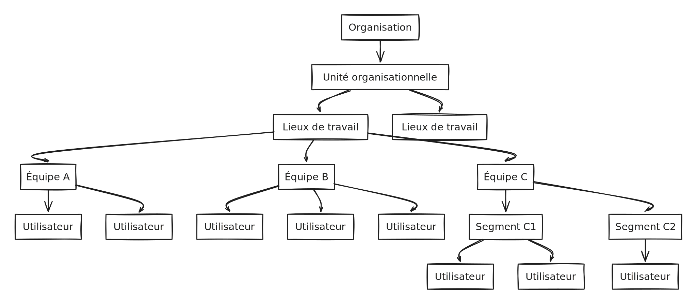

# Overview

Braver is structured to provide maximum user-friendliness while applying top-notch security controls to ensure flawless compliance for healthcare organizations.

<figure><figcaption></figcaption></figure>

### Understanding the organizational structure


[organizational-units](organizational-units/)



[workplaces](workplaces/)



[teams](teams/)



[users](users/)


### Understanding the tools at your disposal


[audit-logs](audit-logs/)



[remotely-managed-mobile-device.md](remotely-managed-mobile-device.md)


### Other important technical details


[connectivity.md](../technical-details/connectivity.md)



[compatibility.md](../technical-details/compatibility.md)
