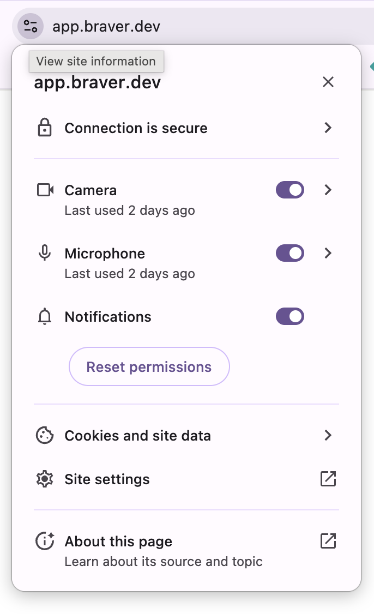
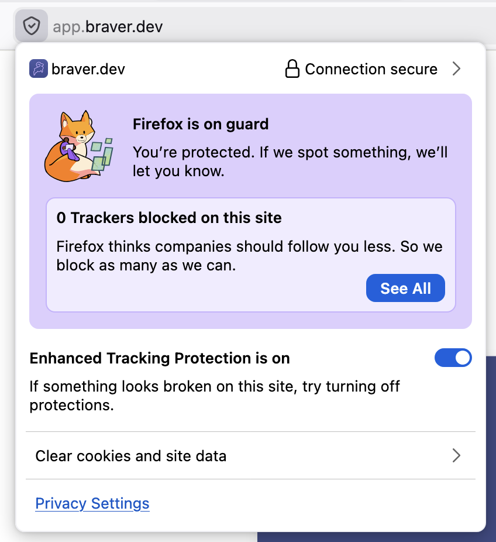

# Web Browser Notification Permissions

If you previously denied notification permissions for Braver in your browser, you will need to access the site settings to re-enable this permission.


The screenshots below may vary slightly depending on your browser version.


## Google Chrome



### Click on the lock icon and change the notification permission

In the address bar, click on the icon to the left of the URL. Find the **"Notifications"** row and change the value from **"Block"** to **"Allow"**.

<figure><figcaption></figcaption></figure>



### Reload the page

Close the settings panel and reload the Braver page for the changes to take effect.



---

## Microsoft Edge



### Click on the lock icon

In the address bar, click on the lock icon to the left of the URL.

<!-- <figure><figcaption></figcaption></figure> -->



### Access permissions for this site

Click on **"Permissions for this site"** in the dropdown menu.

<!-- <figure><figcaption></figcaption></figure> -->



### Enable notifications

In the **"Notifications"** section, change the setting from **"Block"** or **"Ask"** to **"Allow"**.

<!-- <figure><figcaption></figcaption></figure> -->



### Reload the page

Reload the Braver page to apply the changes.



---

## Mozilla Firefox



### Click on the protection icon and manage permissions

In the address bar, click on the shield or lock icon to the left of the URL. In the **"Permissions"** section, find **"Notifications"** and click the **"X"** next to **"Blocked"** to remove the block.

<figure><figcaption></figcaption></figure>



### Reload the page

Reload the Braver page. You should now see a permission request for notifications.



---

## Apple Safari


Safari handles notification permissions differently from other browsers. Web notifications must be enabled in Safari preferences.




### Open Safari Preferences

In the menu bar, click on **Safari** > **Settings** (or **Preferences** on older versions).

<!-- <figure><figcaption></figcaption></figure> -->



### Go to the Websites tab

Click on the **"Websites"** tab in the preferences window.

<!-- <figure><figcaption></figcaption></figure> -->



### Select Notifications

In the left column, click on **"Notifications"**.

<!-- <figure><figcaption></figcaption></figure> -->



### Allow notifications for Braver

Find **app.braver.net** in the list and change the setting from **"Deny"** to **"Allow"**.

If Braver doesn't appear in the list, visit the Braver application and you should see a permission request.

<!-- <figure><figcaption></figcaption></figure> -->



### Close and reload

Close the preferences and reload the Braver page.



---

## Need more help?

If you have difficulty enabling notifications, feel free to [contact us](mailto:support@braver.health).
