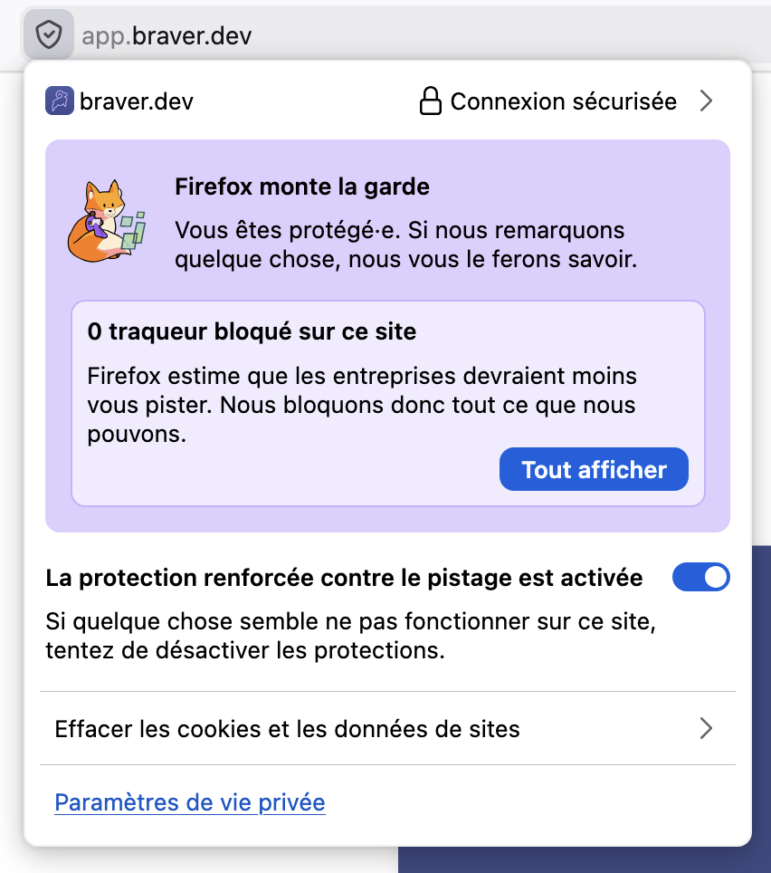

# Permissions de notifications sur navigateurs Web

Si vous avez précédemment refusé les notifications de Braver dans votre navigateur, vous devrez accéder aux paramètres du site pour réactiver cette permission.


Les captures d'écran ci-dessous peuvent varier légèrement selon la version de votre navigateur.


## Google Chrome



### Cliquez sur l'icône de cadenas et modifiez la permission des notifications

Dans la barre d'adresse, cliquez sur l'icône à gauche de l'URL. Trouvez la ligne **"Notifications"** et changez la valeur de **"Bloquer"** à **"Autoriser"**.

<figure><figcaption></figcaption></figure>



### Rechargez la page

Fermez le panneau des paramètres et rechargez la page Braver pour que les changements prennent effet.



---

## Microsoft Edge



### Cliquez sur l'icône de cadenas

Dans la barre d'adresse, cliquez sur l'icône de cadenas à gauche de l'URL.

<!-- <figure><figcaption></figcaption></figure> -->



### Accédez aux autorisations pour ce site

Cliquez sur **"Autorisations pour ce site"** dans le menu déroulant.

<!-- <figure><figcaption></figcaption></figure> -->



### Activez les notifications

Dans la section **"Notifications"**, changez le paramètre de **"Bloquer"** ou **"Demander"** à **"Autoriser"**.

<!-- <figure><figcaption></figcaption></figure> -->



### Rechargez la page

Rechargez la page Braver pour appliquer les modifications.



---

## Mozilla Firefox



### Cliquez sur l'icône de protection et modifiez les permissions

Dans la barre d'adresse, cliquez sur l'icône de bouclier ou de cadenas à gauche de l'URL. Dans la section **"Permissions"**, trouvez **"Notifications"** et cliquez sur le **"X"** à côté de **"Bloqué"** pour supprimer le blocage.

<figure><figcaption></figcaption></figure>



### Rechargez la page

Rechargez la page Braver. Vous devriez maintenant voir une demande de permission pour les notifications.



---

## Apple Safari


Safari gère les permissions de notification différemment des autres navigateurs. Les notifications Web doivent être activées dans les préférences de Safari.




### Ouvrez les préférences de Safari

Dans la barre de menu, cliquez sur **Safari** > **Réglages** (ou **Préférences** sur les versions plus anciennes).

<!-- <figure><figcaption></figcaption></figure> -->



### Accédez à l'onglet Sites Web

Cliquez sur l'onglet **"Sites web"** dans la fenêtre des préférences.

<!-- <figure><figcaption></figcaption></figure> -->



### Sélectionnez Notifications

Dans la colonne de gauche, cliquez sur **"Notifications"**.

<!-- <figure><figcaption></figcaption></figure> -->



### Autorisez les notifications pour Braver

Trouvez **app.braver.net** dans la liste et changez le paramètre de **"Refuser"** à **"Autoriser"**.

Si Braver n'apparaît pas dans la liste, visitez l'application Braver et vous devriez voir une demande de permission.

<!-- <figure><figcaption></figcaption></figure> -->



### Fermez et rechargez

Fermez les préférences et rechargez la page Braver.



---

## Besoin d'aide supplémentaire?

Si vous rencontrez des difficultés à activer les notifications, n'hésitez pas à [nous contacter](mailto:support@braver.health).
