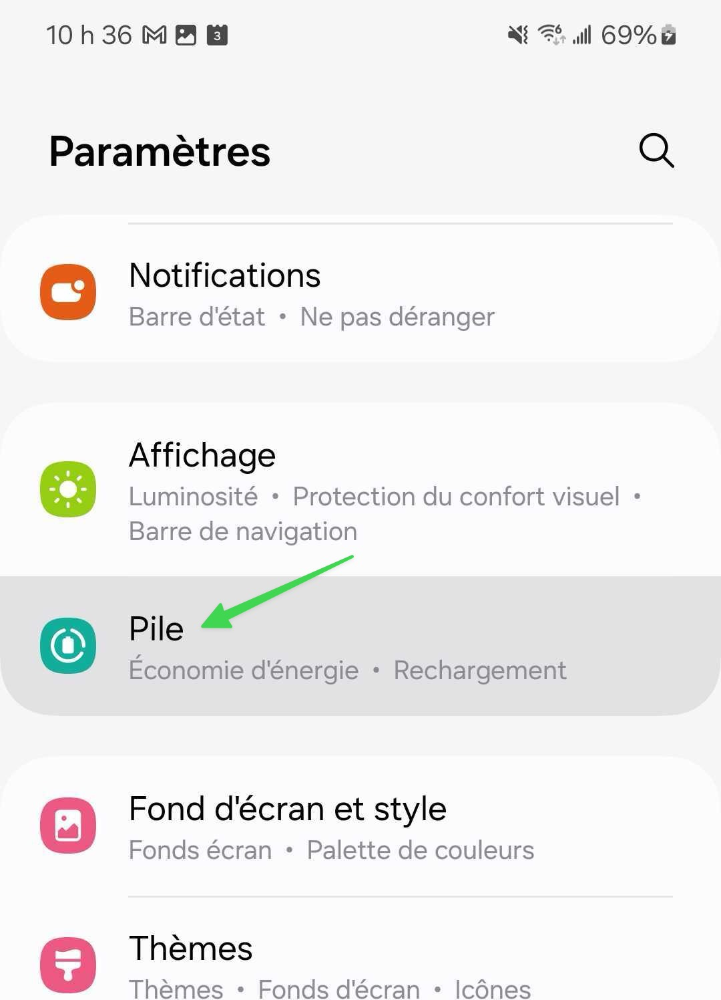

# Mise en veille d'applications en arrière-plan

## Le problème

Sur les téléphones Samsung Galaxy, la fonction de mise en veille des applications inutilisées désactive leur activité en arrière-plan. Si une application est mise en veille, vous ne recevrez ses notifications que lorsque vous l'ouvrirez à nouveau.

## La solution

Pour empêcher la mise en veille automatique :&#x20;



### Allez dans les paramètres puis dans la section Pile

<figure><figcaption></figcaption></figure>




### Puis naviguez vers Limites utilisation arrière-plan

<figure><figcaption></figcaption></figure>




### Désactivez l'option Mise en veille applis inutilisées

<figure><figcaption></figcaption></figure>



