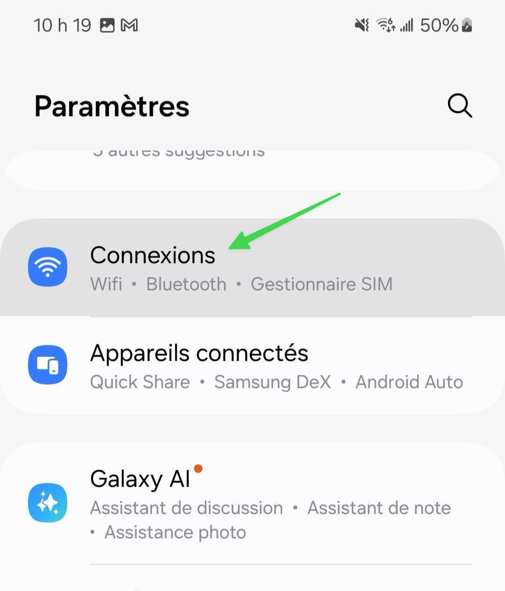
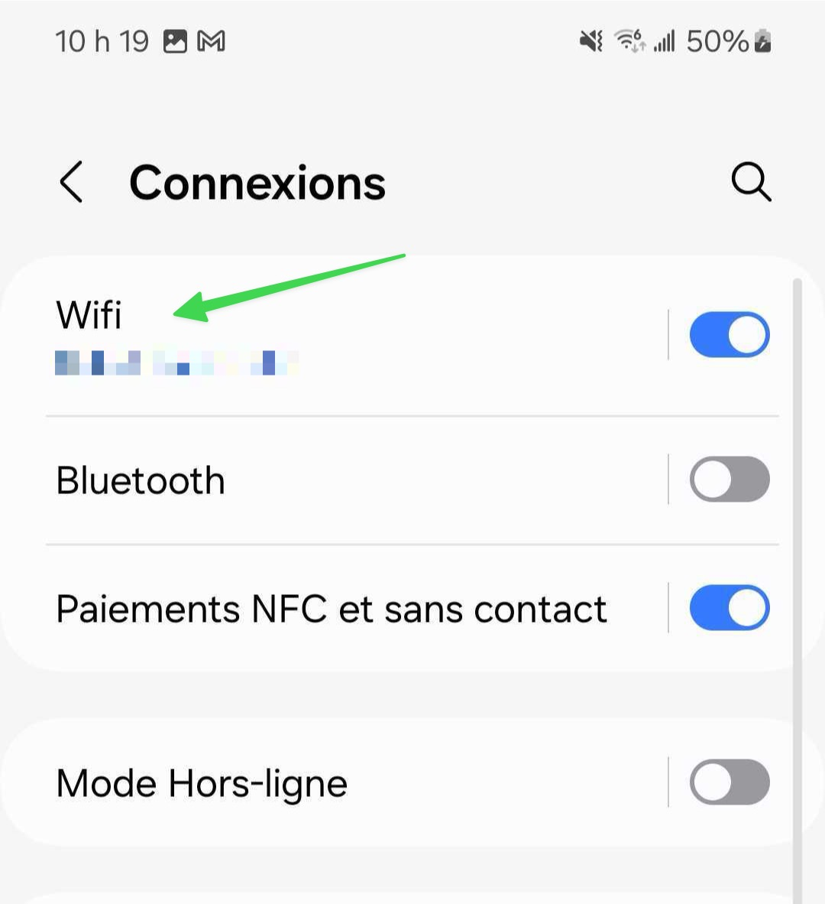
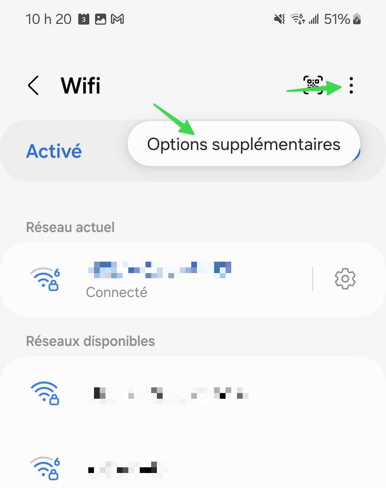
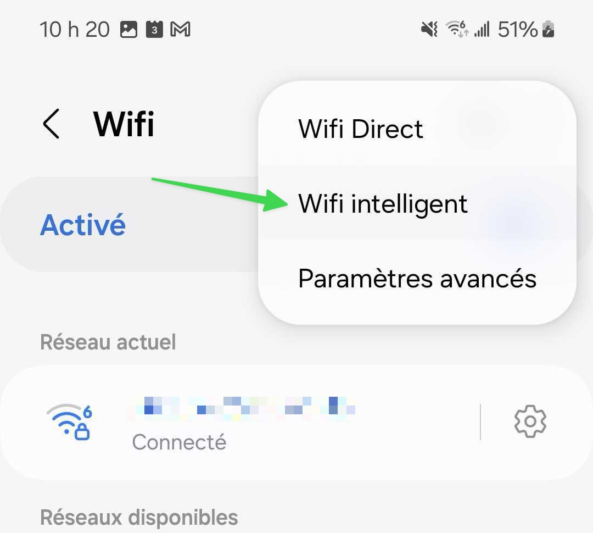
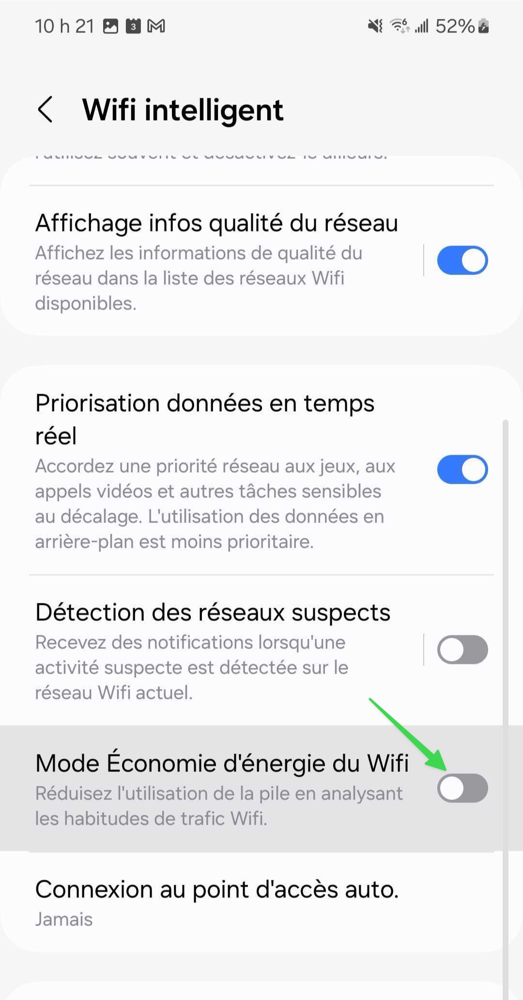

# Réduction intelligente de l'utilisation Wifi

## Le problème

Le mode d'économie d'énergie Wi-Fi réduit la fréquence de communication entre votre téléphone et le réseau Wi-Fi lorsque l'écran est éteint ou que l'appareil est inactif. Cela peut entraîner des retards dans la réception de vos notifications.

## La solution

Pour désactiver ce mode :&#x20;



### Allez dans les paramètres puis dans la section Connexions

<figure><figcaption></figcaption></figure>




### Allez dans la section Wifi

<figure><figcaption></figcaption></figure>




### Puis appuyez sur les trois points en haut à droite, puis sur Options supplémentaires

<figure><figcaption></figcaption></figure>




### Puis sur Wifi intelligent

<figure><figcaption></figcaption></figure>




### Désactivez le mode Économie d'énergie du Wifi

<figure><figcaption></figcaption></figure>



