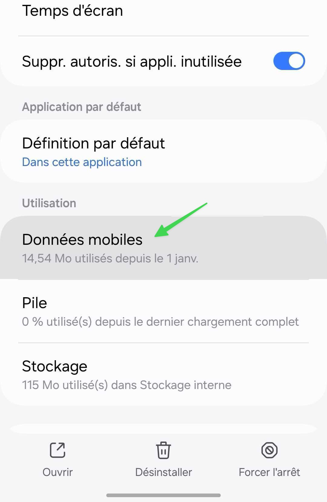
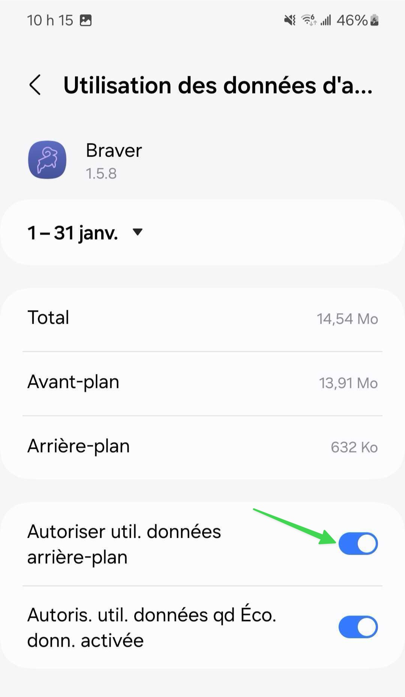
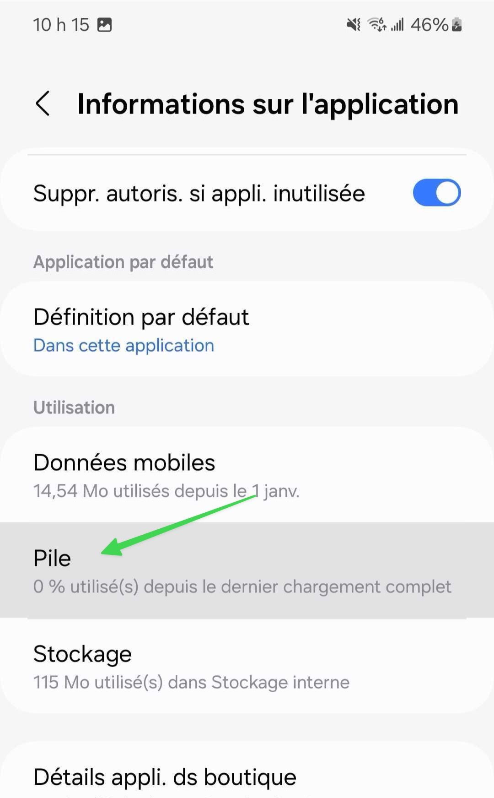
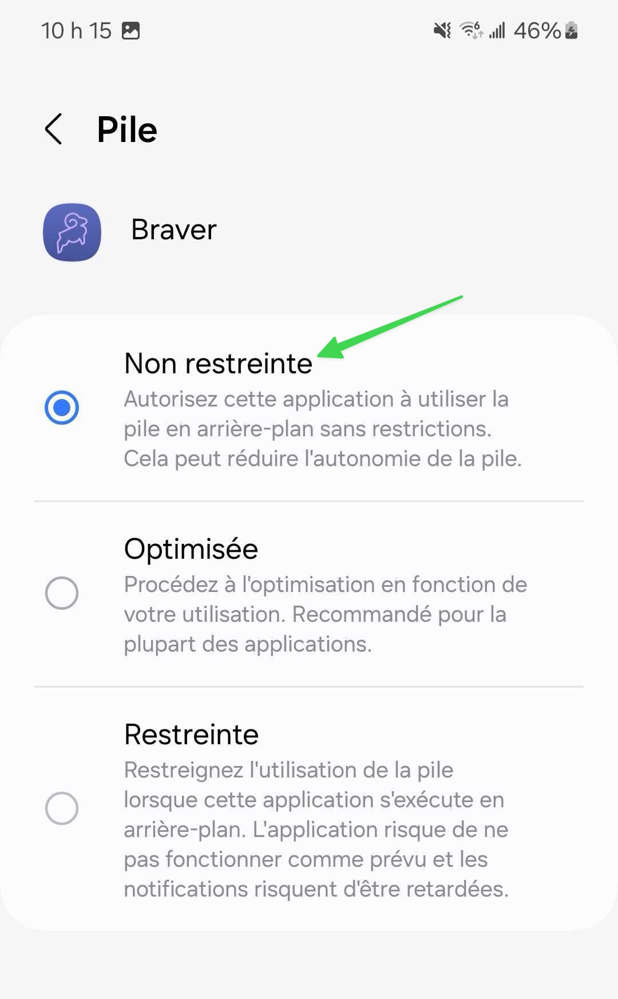

# Restrictions individuelle de batterie et de données

## Le problème

Certaines applications peuvent avoir des restrictions individuelles de batterie et de données qui empêchent la réception des notifications en temps réel.

## La solution



### Appuyez longuement sur l'icône de Braver et touchez l'icône d'information ⓘ

<figure><figcaption></figcaption></figure>




### Dans les paramètres de l'application, allez dans ⁠Données mobiles

<figure><figcaption></figcaption></figure>




### Cliquez sur Autoriser l'utilisation des données en arrière-plan

<figure><figcaption></figcaption></figure>




### Retournez en arrière et allez dans la section Pile

<figure><figcaption></figcaption></figure>




### Sélectionnez l'option "Non restreinte"

<figure><figcaption></figcaption></figure>



