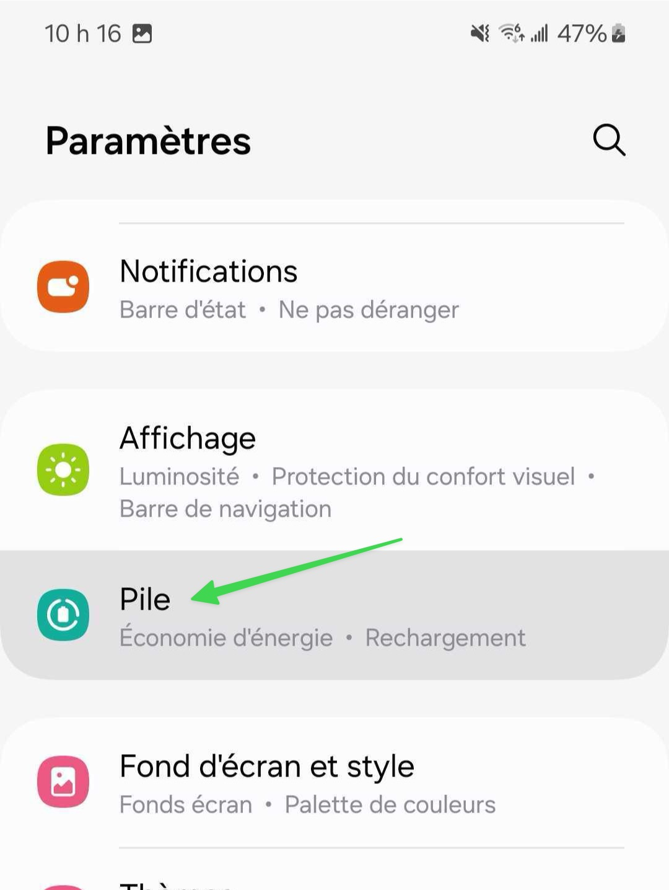

# Utilisation adaptive de la batterie

## Le problème

La fonction de batterie adaptative de votre téléphone peut causer des retards de notifications. Elle limite l'activité en arrière-plan des applications que vous utilisez peu fréquemment pour économiser la batterie.

Cette fonction, particulièrement présente sur les Google Pixel, est souvent citée comme cause principale des notifications retardées.

## La solution

Pour résoudre ce problème :



### Allez dans les paramètres, puis dans la section Pile

<figure><figcaption></figcaption></figure>




### Puis dans la section Protection de la pile

<figure><figcaption></figcaption></figure>




### Sélectionnez l'option Basique ou désactivez l'option complètement

<figure><figcaption></figcaption></figure>



