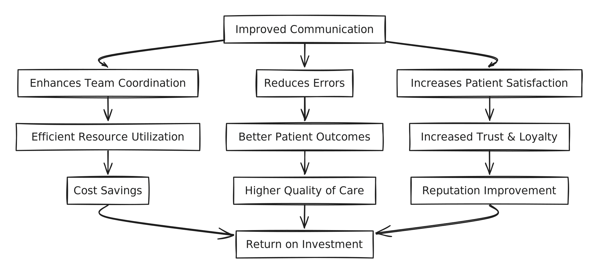

# Survol

Braver est structuré de sorte à fournir le maximum de convivialité aux utilisateurs tout en appliquant des contrôles de sécurité hors pairs afin d'assurer une conformité sans faille aux organisations de santé.

<figure><figcaption></figcaption></figure>

### Comprendre la structure organisationnelle


[unites-organisationnelles](unites-organisationnelles/)



[lieux-de-travail](lieux-de-travail/)



[equipes](equipes/)



[utilisateurs](utilisateurs/)


### Comprendre les outils mis à votre disposition


[journaux-daudit](journaux-daudit/)



[appareil-mobile-gere-a-distance.md](appareil-mobile-gere-a-distance.md)


### Autres détails techniques importants


[connectivite.md](../details-techniques/connectivite.md)



[compatibilite.md](../details-techniques/compatibilite.md)

