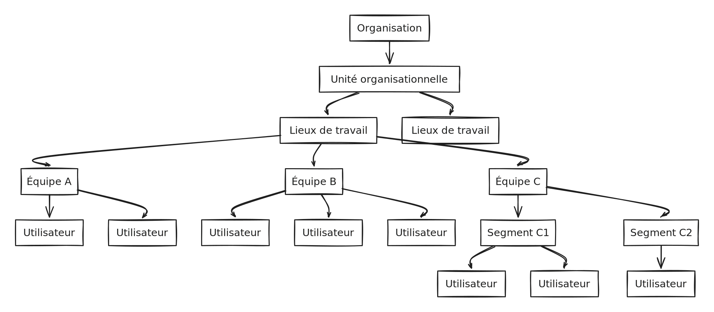

# Configuration Guide

## What can I expect in terms of piloting workload

Configuration and deployment depend on the size of your organization.

For example, for a small organization of around thirty clinicians, its implementation requires only a few hours of work.


If you use Braver through an integration partner (e.g., Leomed or Gustav), configuration and deployment are greatly simplified since many configuration elements are automated from the partner software configuration.


## Braver Concepts

Before beginning the platform configuration, we recommend familiarizing yourself with Braver concepts that will help you define your organizational structure.

The diagram below represents the hierarchy of concepts in Braver that allow you to configure your organizational structure.

To go deeper into the concepts

Here are documentation sections that might be useful to you:

* [Organization](for-administrators/organisation)
* [Organizational Units](for-administrators/organisational-units)
* [Workplaces](for-administrators/workplaces)
* [Teams](for-administrators/teams)
* Segments (coming soon)
* [Users](for-administrators/users)
* [Audit Logs](for-administrators/audit-logs)
* Directory (coming soon)

## Configure Braver

Ready to start your configuration? Click on what applies to your organization:

<table data-view="cards"><thead><tr><th></th><th></th><th data-hidden data-card-cover data-type="files"></th><th data-hidden data-card-target data-type="content-ref"></th></tr></thead><tbody><tr><td>I deploy Braver</td><td><strong>independently</strong></td><td><a href="../../.gitbook/assets/braver (1).png">braver (1).png</a></td><td><a href="deploy-braver-independently.md">deploy-braver-independently.md</a></td></tr><tr><td>I deploy Braver via</td><td><strong>Leomed</strong></td><td><a href="../../.gitbook/assets/leomed.png">leomed.png</a></td><td><a href="../../integrations/leomed/deploy-braver-via-leomed-platform.md">deploy-braver-via-leomed-platform.md</a></td></tr><tr><td>I deploy Braver via</td><td><strong>Gustav</strong></td><td><a href="../../.gitbook/assets/gustab.png">gustab.png</a></td><td><a href="../../integrations/gustav/deploy-braver-via-gustav-platform.md">deploy-braver-via-gustav-platform.md</a></td></tr></tbody></table>

## Patient and Caregiver Module

If you plan to use the patient and caregiver module via mobile devices (e.g., tablets) provided and managed by your organization, here is [a document to guide you in choosing devices and certain elements to consider.](https://support-en.braver.net/for-administrators/remotely-managed-mobile-device)

If you plan to use the patient and caregiver module by inviting them to their personal devices (mobile or computer), we recommend supporting people in creating their accounts. If you do this in person, ensure you have access to a WiFi network or cellular data.

We have also developed an express training tool for patients that you can use in electronic or paper version.

## Other Technical Details

* [Connectivity Information](https://support-en.braver.net/technical-details/connectivity)
* [Device Compatibility Information](https://support-en.braver.net/technical-details/compatibility)

