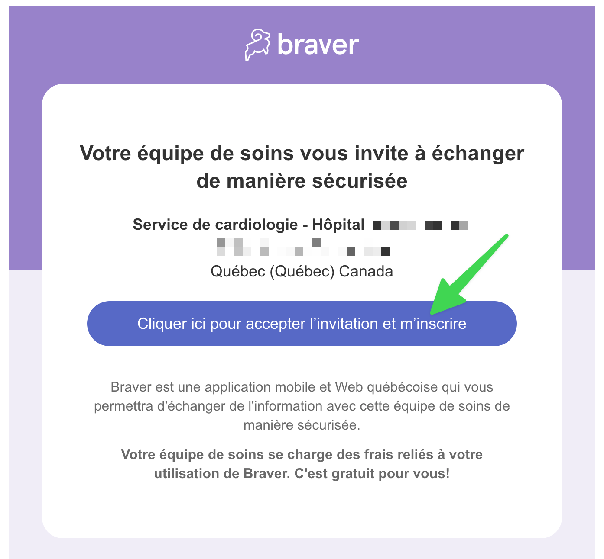
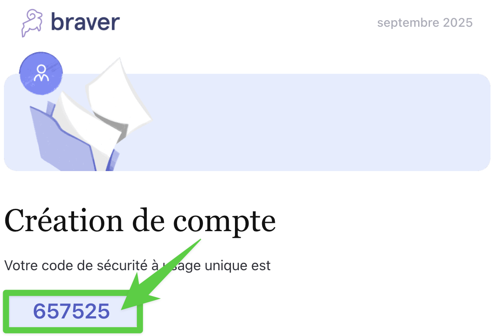
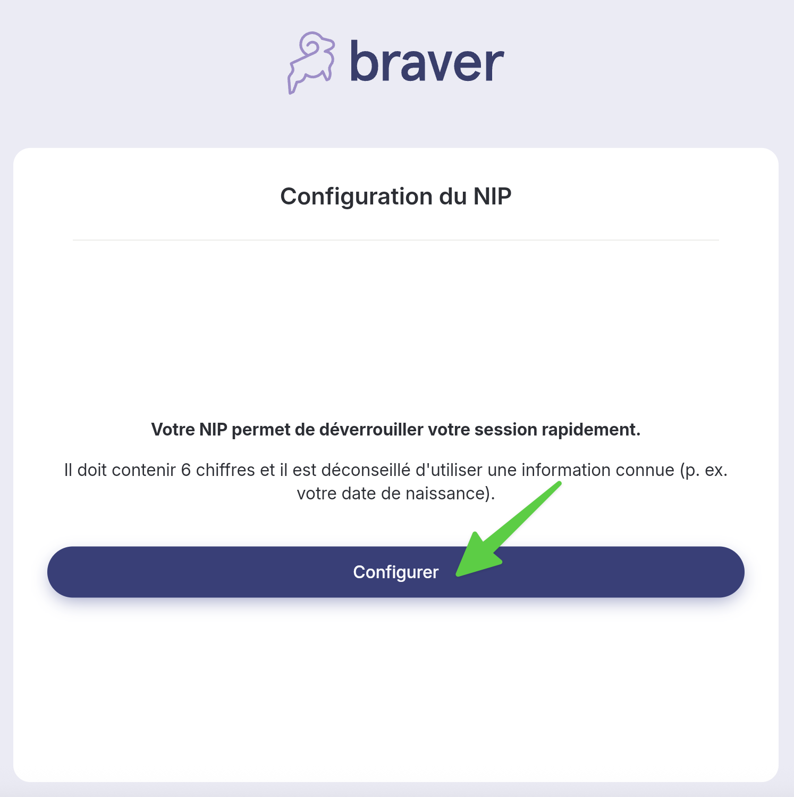
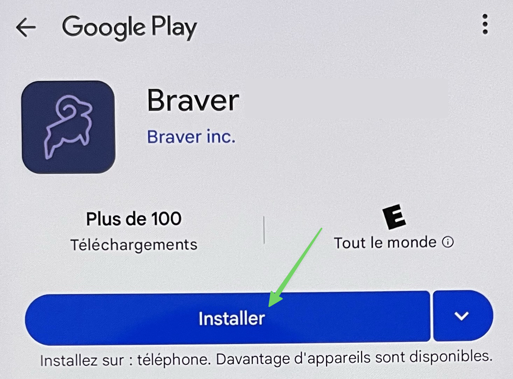
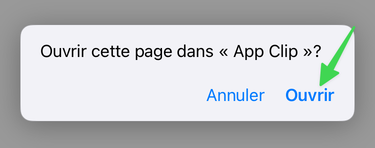

# Accept Invitation to Join Care Team on Braver

## Step-by-Step


You can create your account on a mobile device (phone or tablet) or a computer. You may have received an invitation by SMS or email.




**In the email you received, click the button to accept the invitation.**


**📱If you were invited by SMS, click the secure invitation link.**


<figure><figcaption></figcaption></figure>



**Is this your first time opening Braver?** Select _Create a new account_.


Is your screen showing something different? [Click here](accept-invitation.md#other-cases).


<figure><figcaption></figcaption></figure>




**Choose a password and repeat it. Then select&#x20;**_**Create my account**_**.**


**📱If you were invited by SMS, also fill in the email field. We'll send you a code to confirm your email address. (See next step)**


<figure><figcaption></figcaption></figure>





**📱If you were invited by SMS, retrieve the 6-digit security code from your email and enter it in the text field.**


<figure><figcaption></figcaption></figure>



**Accept the terms of use.** Scroll to the bottom of the page to accept.

<figure><figcaption></figcaption></figure>




**Set up a PIN to easily unlock your app.** Click on _Configure_.

<figure><figcaption></figcaption></figure>




**Create your PIN and repeat it. If you're on a computer, skip to step 10.**

<figure><figcaption></figcaption></figure>




## **You're now in Braver!**


**📱**If you are on a mobile device (phone or tablet), you must download the app to continue.

* Android, continue by [clicking here](accept-invitation.md#android-download-the-app).
* iOS, continue by [clicking here](accept-invitation.md#ios-download-the-app).


<figure><figcaption></figcaption></figure>



### 📱Android: Download the app


9.1 📱**Android** mobile device (phone or tablet), click on _Next._


<figure><figcaption></figcaption></figure>


9.2📱**Android** mobile device (phone or tablet), click on _Install_.


<figure><figcaption></figcaption></figure>


9.3📱**Android** mobile device (phone or tablet), click on Open. **You're now in Braver!**




### 📱iOS: Download the app


10.1📱**iOS** mobile device (phone or tablet), click on _Next_.


<figure><figcaption></figcaption></figure>


10.2📱**iOS** mobile device (phone or tablet), click on _Open._


<figure><figcaption></figcaption></figure>


10.3📱**iOS** mobile device (phone or tablet), click on the blue button.


<figure><figcaption></figcaption></figure>


10.4📱**iOS** mobile device (phone or tablet), click on this button. **You're now in Braver!**


<figure><figcaption></figcaption></figure>



***

## Other Cases

### First Case

If this is the first time you are opening Braver, but Braver has already been used by someone else on your device, you will see a screen like the following:

<figure><figcaption></figcaption></figure>

\
Next, select the "Create a new account" option to proceed to [step 3](accept-invitation.md#step-1). If you already have a Braver account, choose your name or select "Use an existing Braver account" to skip ahead to [step 10](accept-invitation.md#step-1).

### Second Case

If you have already created your account in the past with the same email address as the invitation, but your session is not already active on your device, you will see a screen like the following:

<figure><figcaption></figcaption></figure>

\
In this case, you should enter your password in order to proceed to [step 10](accept-invitation.md#step-by-step).

### Third Case

If you have already created your account in the past with the same email address as the invitation, and your session is already active on your device, you will see a screen like the following:

<figure><figcaption></figcaption></figure>

\
In this case, you should simply enter your PIN to proceed to [step 10](accept-invitation.md#step-by-step).

