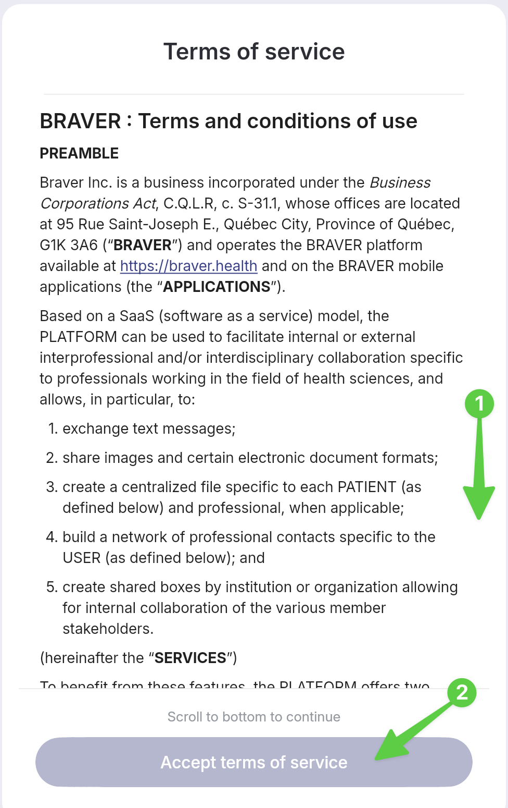
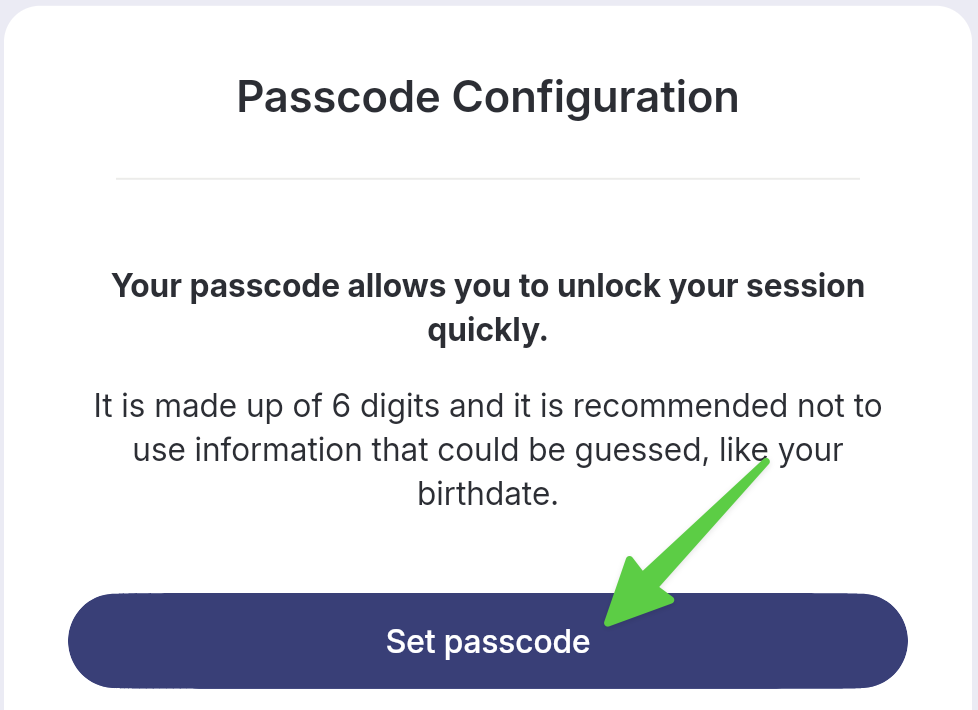
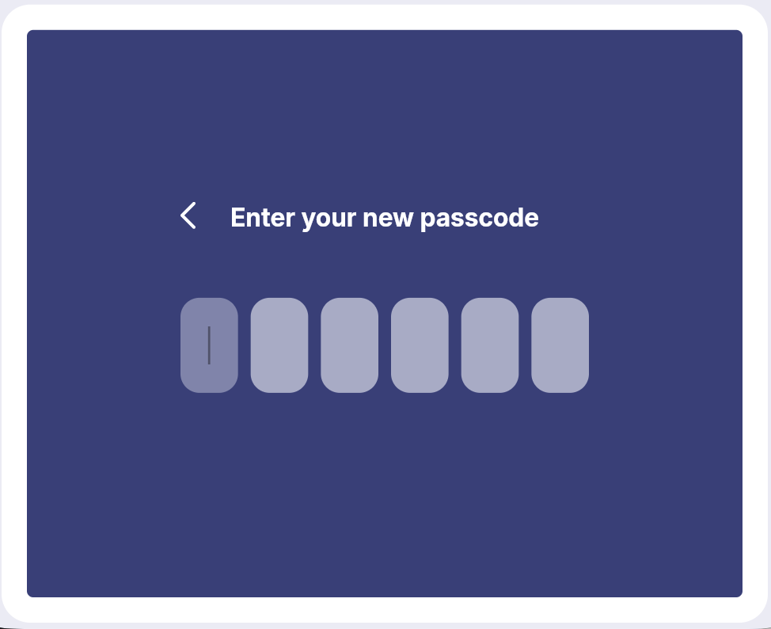
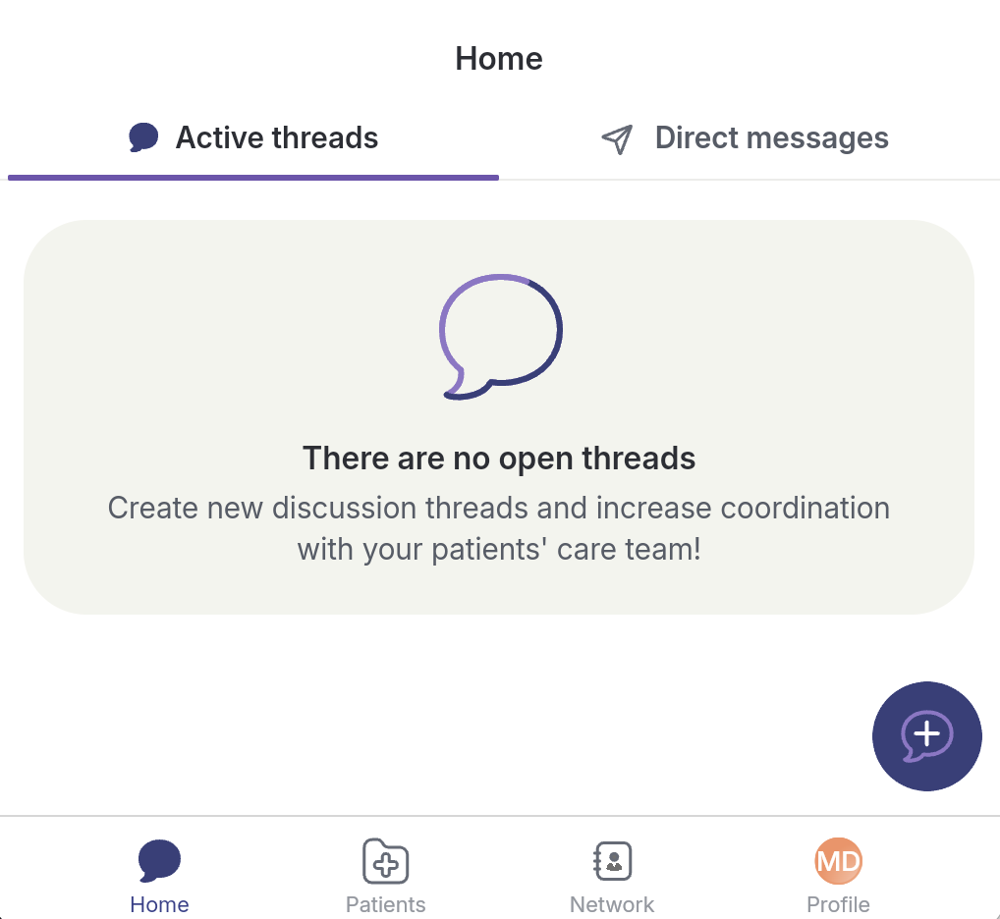

# Independent Account Creation

## Step by Step



**When opening the application, click:&#x20;**_**Sign up for free!**_

<figure><figcaption></figcaption></figure>




**1) Enter your email address and 2) the password of your choice. 3)Repeat your new password a second time. 4) Then select&#x20;**_**Create my account**_**.**

<figure><figcaption></figcaption></figure>




**Retrieve the 6-digit security code from your emails and enter it in the provided text field. Click on&#x20;**_**Create my account.**_


Remember to check your spam folder if it does not appear in your email inbox quickly.


<figure><figcaption></figcaption></figure>




**Create your profile. Click&#x20;**_**Create a profile**_**&#x20;to save your information.**

<figure><figcaption></figcaption></figure>




**Scroll to the bottom of the page and select&#x20;**_**Accept terms of service**_**.**

<figure><figcaption></figcaption></figure>




**Set up a PIN that you can use to unlock the app easily if you do not use Face ID or facial recognition. Click&#x20;**_**Set up**_**.**

<figure><figcaption></figcaption></figure>




**Enter your PIN and repeat it a second time.**

<figure><figcaption></figcaption></figure>




**Choose if you consent to receive communications from Braver.**

<figure><figcaption></figcaption></figure>




**You are now in Braver!**

<figure><figcaption></figcaption></figure>



