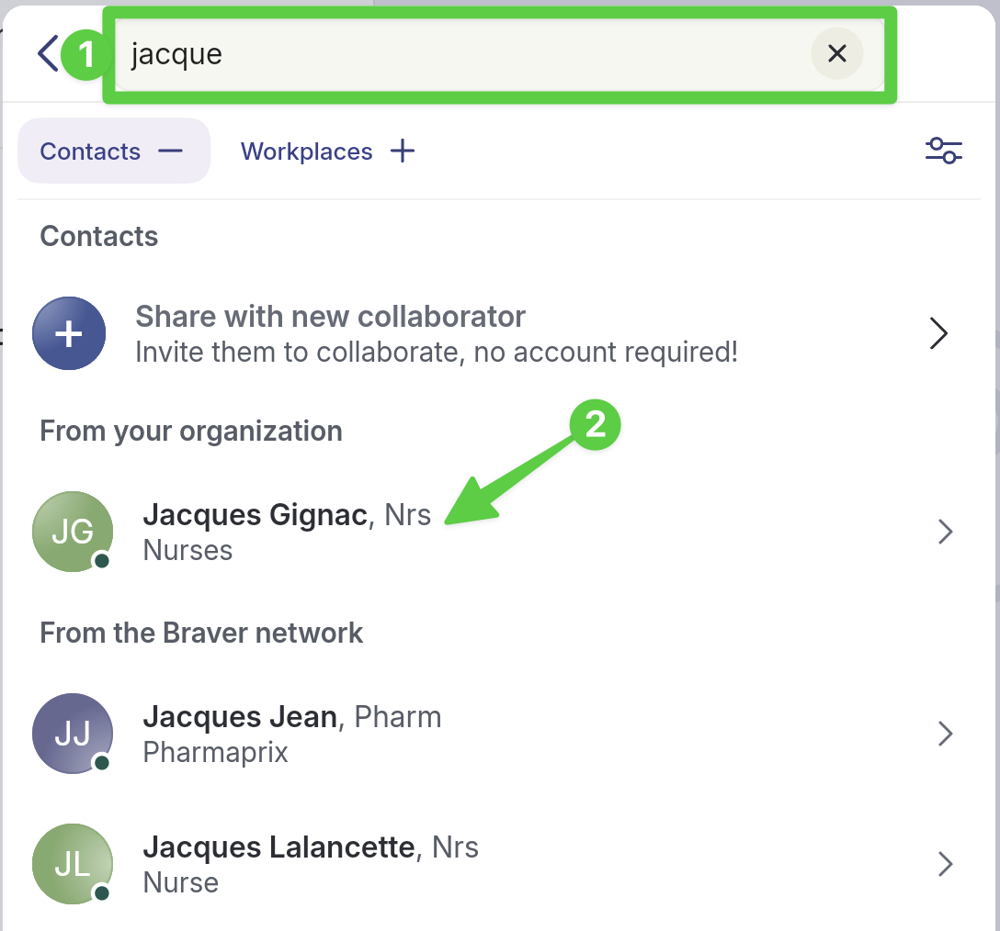
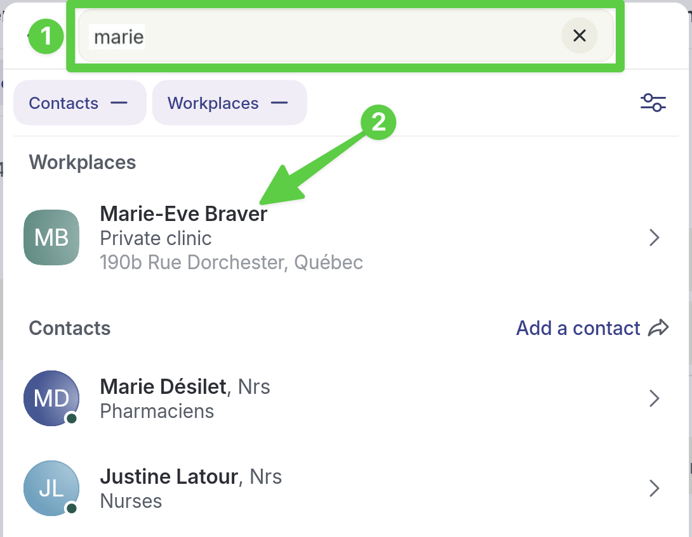
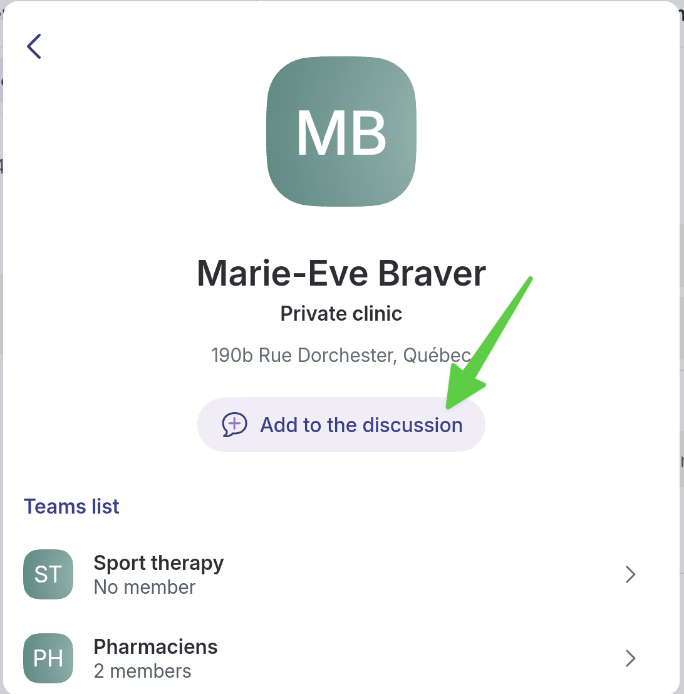
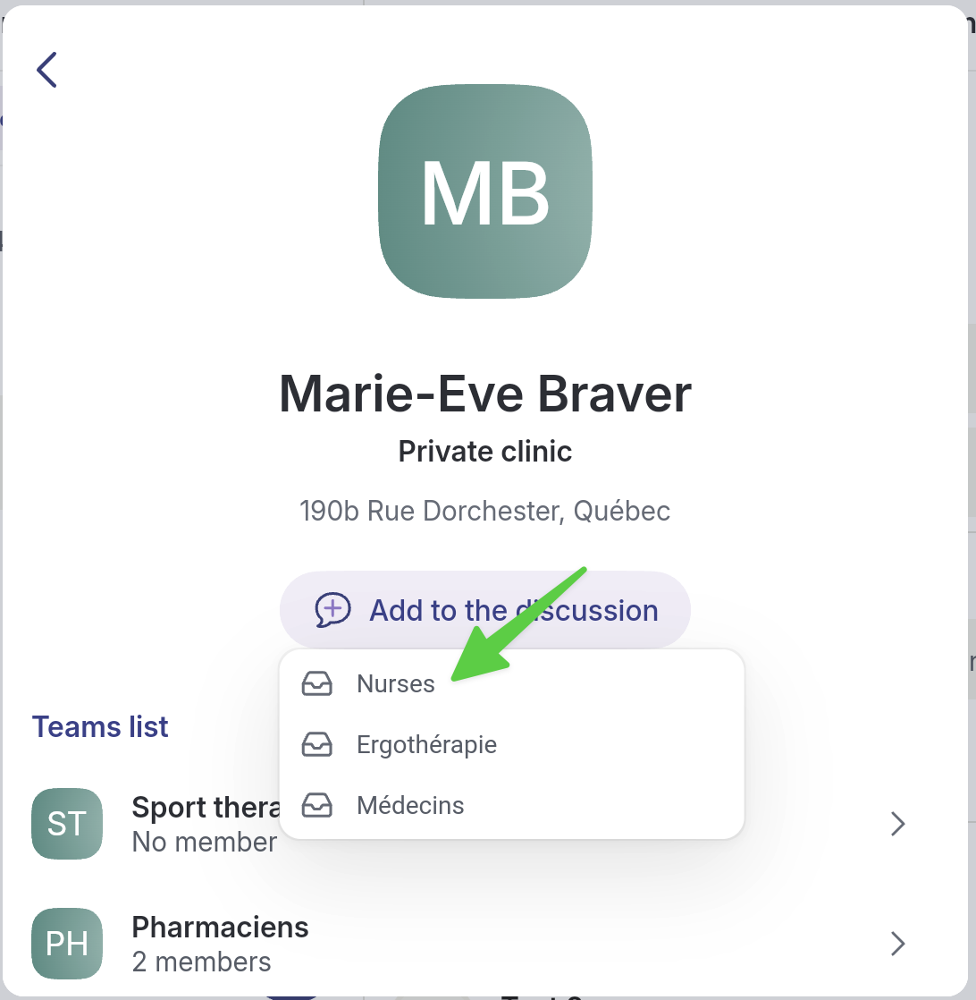

# Create a New Non-Clinical Discussion Thread

## Step-by-Step

* [Scenario 1: Add one or more participants](create-non-clinical-discussion-thread.md#scenario-1-add-one-or-more-participants)
* [Scenario 2: Add one or more teams](create-non-clinical-discussion-thread.md#scenario-2-add-one-or-more-teams)
* [Another way to create a non-clinical discussion thread](create-non-clinical-discussion-thread.md#another-way-to-create-a-non-clinical-discussion-thread)

## Scenario 1: Add one or more participants



**Go to the&#x20;**_**Home**_**&#x20;page.**

<figure><figcaption></figcaption></figure>




**Select the bubble icon at the bottom of the page.**

<figure><figcaption></figcaption></figure>




**Choose&#x20;**_**Non-clinical thread**_**.**

<figure><figcaption></figcaption></figure>




**In the composition menu:**

1. **Enter a title for your message.**
2. **Write the message content.**
3. **Select&#x20;**_**Attachments**_**&#x20;to add files if needed.**
4. **Set the priority to urgent if needed.**
5. **Click&#x20;**_**Next**_**&#x20;to go to the second composition page.**

<figure><figcaption></figcaption></figure>




**Click&#x20;**_**Add a participant**_**.**

<figure><figcaption></figcaption></figure>




1. **Use the search bar to find the participants you want.**&#x20;
2. **Click the name of the person you want to add.**


To add a team, see [_**Scenario 2: Add one or more teams**_](create-non-clinical-discussion-thread.md#scenario-2-add-one-or-more-teams) below.


<figure><figcaption></figcaption></figure>




**After selecting the participant, click&#x20;**_**Add to the discussion**_**.**

<figure><figcaption></figcaption></figure>




**Click&#x20;**_**Send**_**&#x20;at the bottom of the page.**

<figure><figcaption></figcaption></figure>





**Where to Find Them:**

* _Non-clinical threads_ are accessible from the _Home_ page. They are the ones not linked to a purple patient file (see image).
* You can also find _Non-clinical threads_ under the _Network_ page by selecting one of your collaborators for this thread.


## **Scenario 2: Add one or more teams**



**In step 6 of Scenario 1, click the workplace where your team is located:**

1. **Use the search bar to find the desired workplace.**
2. **Click the name of the workplace where the team you want to add is located.**

<figure><figcaption></figcaption></figure>




**After selecting the workplace, click&#x20;**_**Add to the discussion**_**.**

<figure><figcaption></figcaption></figure>




**Click the name of the team you want to add.**

<figure><figcaption></figcaption></figure>




**Click&#x20;**_**Send**_**&#x20;at the bottom of the page.**

<figure><figcaption></figcaption></figure>




## **Another way to create a non-clinical discussion thread**

1\) In the **Network** tab, 2) select your contact and 3) click **New thread**.

<figure><figcaption></figcaption></figure>

