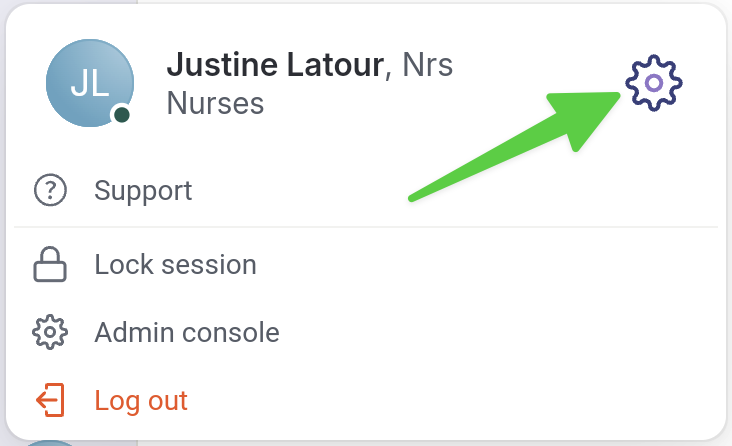

# Configure Phone Number Accessible to Friends

## Step by Step



**Start by navigating to your profile at the bottom of the screen.**

<figure><figcaption></figcaption></figure>




**Under the&#x20;**_**Personal Phone Number**_**&#x20;section, click on&#x20;**_**Number Not Configured**_**.**

<figure><figcaption></figcaption></figure>




**Enter your phone number here.**

<figure><figcaption></figcaption></figure>




**Click the orange checkmark to save.**

<figure><figcaption></figcaption></figure>



