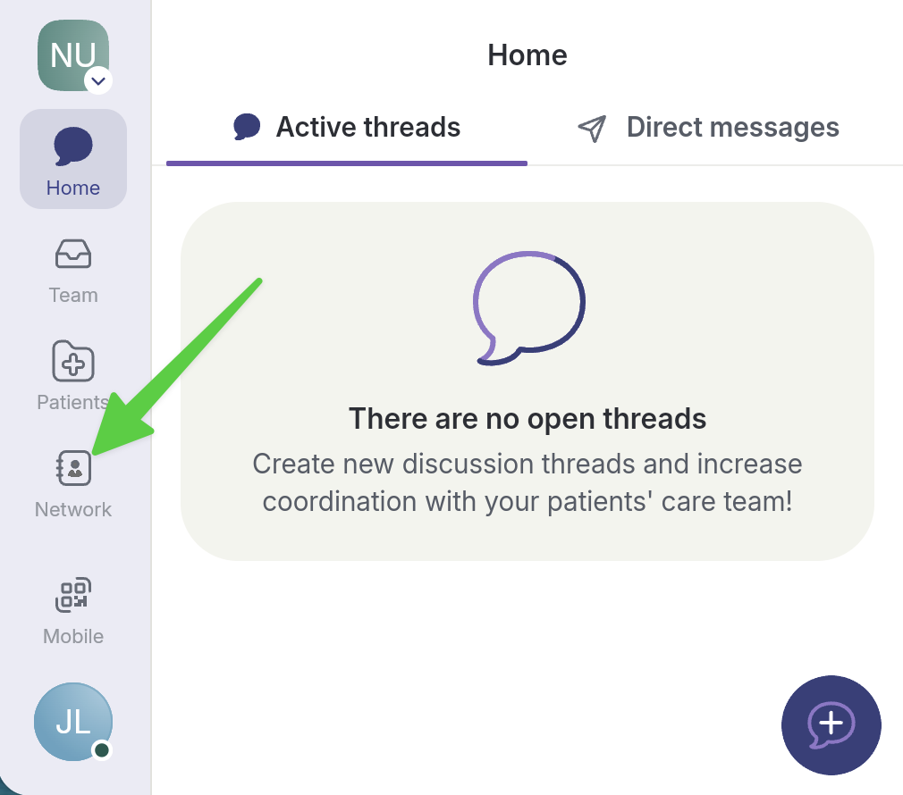
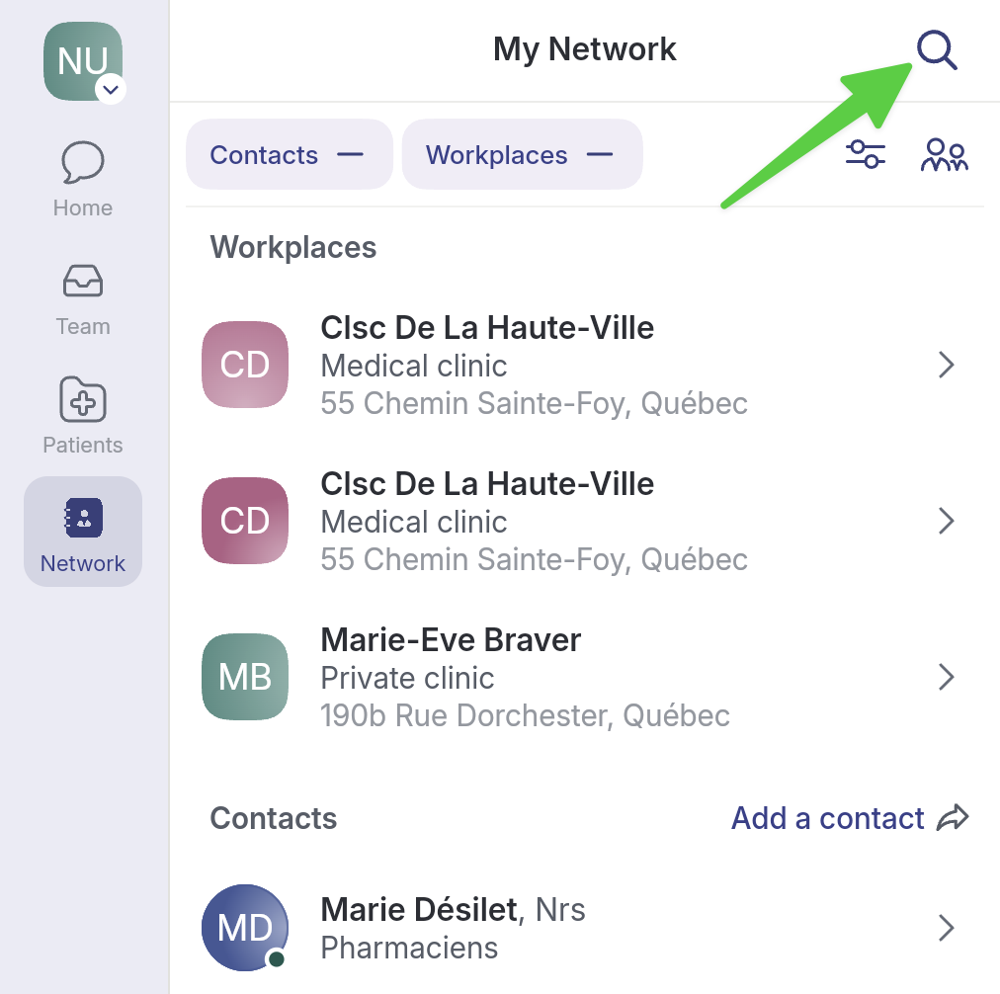

# Invite a Healthcare Professional to Join Braver Network

## Step by Step



**Go to the Network page.**

<figure><figcaption></figcaption></figure>




**Search for the name of the person you want to join.**

<figure><figcaption></figcaption></figure>




**They are not part of the network? Click on&#x20;**_**Invite a New Member**_**.**

<figure><figcaption></figcaption></figure>




**Fill in all invitation fields. Make sure to choose the correct profession for your invitee. When you invite a member to the network, you vouch for their identity.**

<figure><figcaption></figcaption></figure>




**Add his workplace**

<figure><figcaption></figcaption></figure>




**Activate the toggle&#x20;**_**Send invitation now**_**.**

<figure><figcaption></figcaption></figure>




**Choose your invitee’s language preference.**

<figure><figcaption></figcaption></figure>




**Select your preferred option between&#x20;**_**Send by email**_**&#x20;or&#x20;**_**Share a link**_**&#x20;(see step 9).** &#x20;

<figure><figcaption></figcaption></figure>


**It is possible to add a security question that only the recipient knows the answer to. Like with a bank transfer, we want to ensure the right person accepts the invitation.**&#x20;





**Enable Send by link if you want to send your invitation by SMS, for example.**

<figure><figcaption></figcaption></figure>




**Click on&#x20;**_**Send invitation**_**.**

<figure><figcaption></figcaption></figure>



