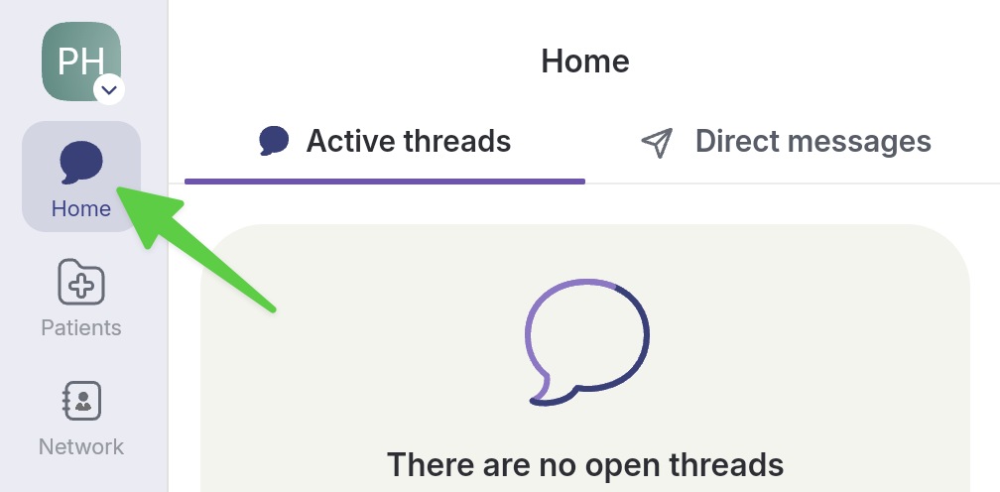

# Exchange Direct Messages


A _direct message_ is only possible between two friends. You will need to send a _friend request_ to the person of your choice, and they must accept before the direct messaging channel opens. Once the channel is open, you can chat freely.

_Direct messages_ are not recorded in patient files and are only visible to you and your "friend".



At the moment, once a friend request has been accepted, it is not possible to close the direct messaging channel.

This limitation will be fixed soon.


## Step-by-Step



**Go to the Home page.**

<figure><figcaption></figcaption></figure>




**To start a direct message, select Direct messages.**

<figure><figcaption></figcaption></figure>




**1) Write your message, 2) add any necessary content or 3) start a call.**&#x20;

<figure><figcaption></figcaption></figure>




**Send your message by selecting the purple arrow.**

<figure><figcaption></figcaption></figure>



