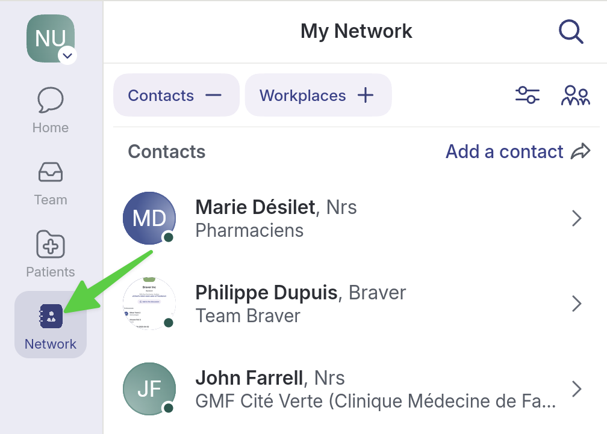

# Archive a Patient File

## Step-by-Step


When you archive a patient file, it is archived only for you or your establishment. If you collaborate with someone from another establishment, the file will not be archived on their side.




**Go to the Patients page.** &#x20;

<figure><figcaption></figcaption></figure>




**Select the patient record you want to archive.**

<figure><figcaption></figcaption></figure>




**In the patient record, select the archive box icon at the top right.**

<figure><figcaption></figcaption></figure>




**Confirm your choice by clicking&#x20;**_**OK**_**. Note that discussion threads about this patient remain active.**

<figure><figcaption></figcaption></figure>




**The patient record is now archived.**

<figure><figcaption></figcaption></figure>



