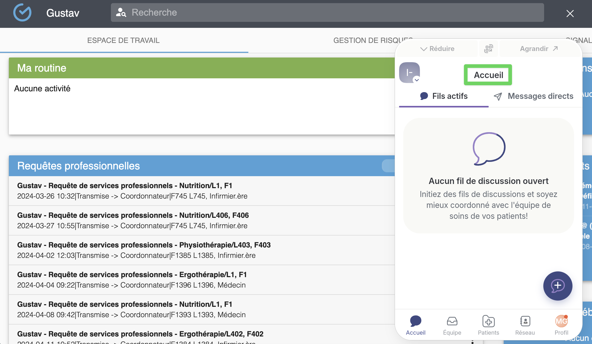

# Profiter de la navigation contextualisée



**Si vous êtes dans la page d'accueil de Gustav, la fenêtre intégrée de Braver sera également à la page d'accueil.**

<figure><figcaption></figcaption></figure>




**Si vous ouvrez le dossier d'un patient, la fenêtre intégrée de Braver sera automatiquement redirigée vers la fiche de ce même patient.**

<figure><figcaption></figcaption></figure>


