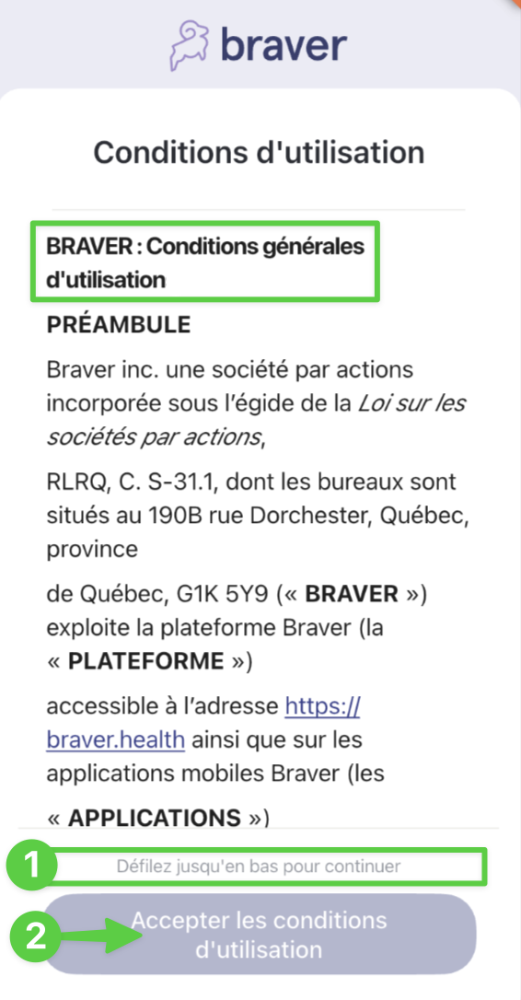
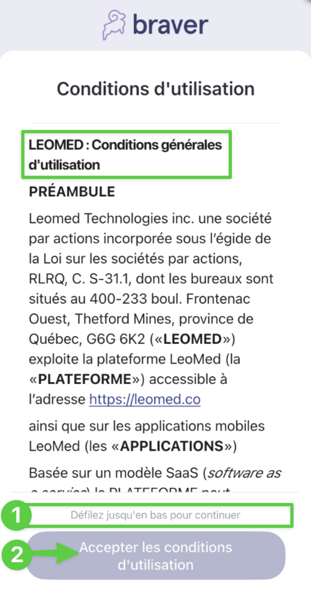

# Activer un compte patient ou proche aidant sur un appareil géré par l'établissement (Leomed)


Cas d'usage: Seulement pour les patients ou proches aidants **à qui vous prêtez un appareil géré par l'établissement**.


## Pas-à-pas



**Dans une fiche patient de Leomed, cliquez sur l'icône de Braver en haut de la fiche du patient à gauche.**

<figure><figcaption></figcaption></figure>




**Ouvrez la caméra de l'appareil mobile iOS ou Android prêté par l'établissement et scannez le code QR.**

<figure><figcaption></figcaption></figure>




**Sélectionnez&#x20;**_**Je n'ai pas encore de compte Braver**_**.**

<figure><figcaption></figcaption></figure>




**Cliquez sur&#x20;**_**OK**_**.**

<figure><figcaption></figcaption></figure>




**1) Faites défiler les conditions générales d'utilisation de Braver jusqu'en bas, puis 2) cliquez sur&#x20;**_**Accepter les conditions d'utilisation**_**.**

<figure><figcaption></figcaption></figure>




**1) Faites défiler les conditions générales d'utilisation de Leomed jusqu'en bas, puis 2) cliquez sur&#x20;**_**Accepter les conditions d'utilisation**_**.**

<figure><figcaption></figcaption></figure>




**Cliquez sur&#x20;**_**Confirmer cette permission**_**&#x20;au sujet des notifications push.**

<figure><figcaption></figcaption></figure>




**Cliquez sur&#x20;**_**Autoriser**_**&#x20;pour confirmer.**

<figure><figcaption></figcaption></figure>




**Refaites les étapes 7 et 8 pour la caméra et le micro.**



**Voilà! Vous avez bien créé le compte du patient ou du proche aidant!**

<figure><figcaption></figcaption></figure>



