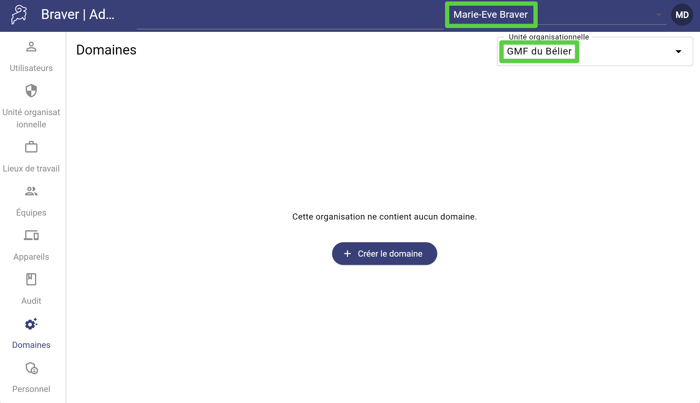
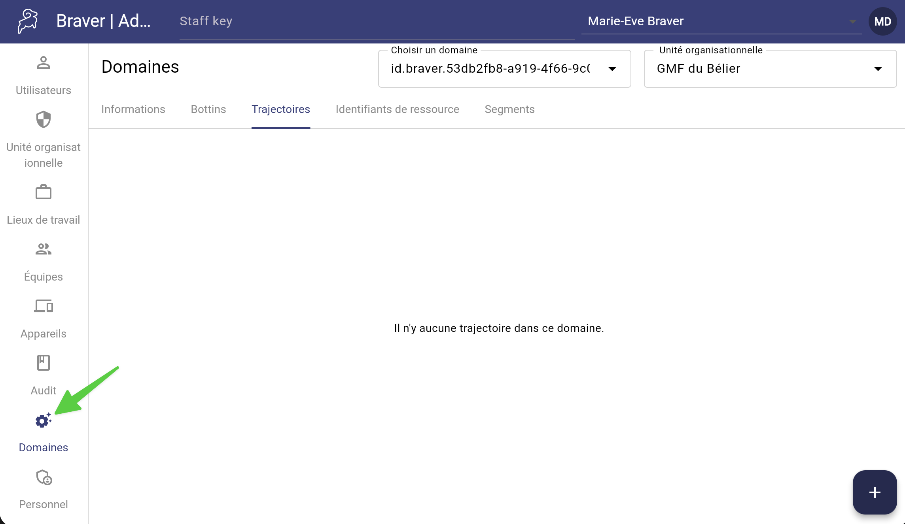
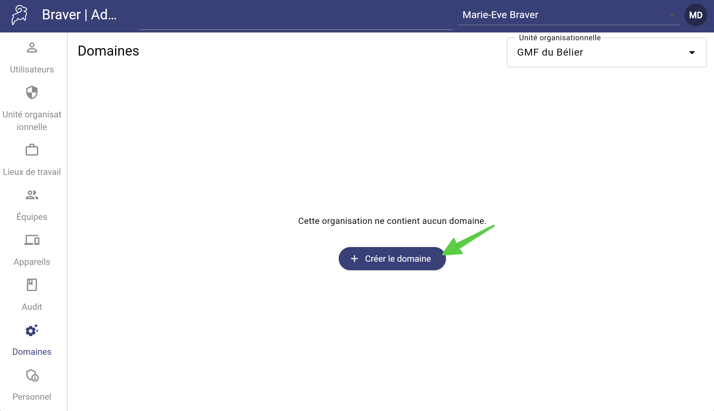
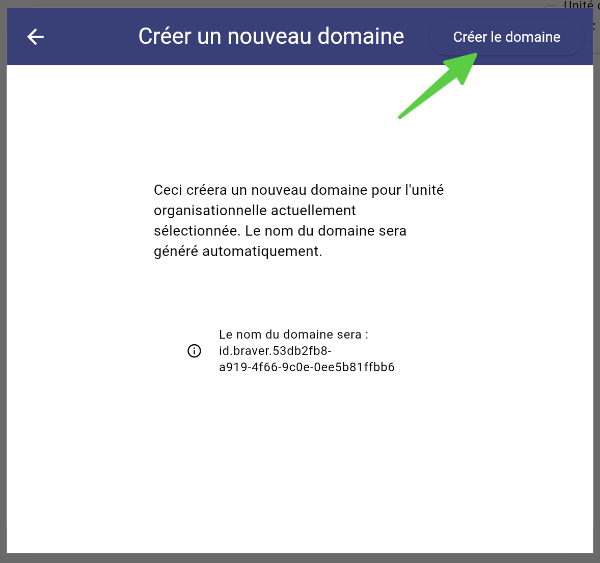

# Créer un domaine

Afin de configurer différents éléments (bottins, identifiants de ressources, trajectoires et segments) et de les partager à vos différentes unités organisationnelles, vous devez débuter par créer un domaine.



### Assurez-vous d'être dans l'organisation et l'unité organisationnelle souhaitée, si cela s'applique à votre situation.

<figure><figcaption></figcaption></figure>




### Accédez à la page _Domaines_.

<figure><figcaption></figcaption></figure>




### Cliquez sur _Créer le domaine_.

<figure><figcaption></figcaption></figure>




### Cliquez sur _Créer le domaine_.

<figure><figcaption></figcaption></figure>




### Le domaine est créé!

<figure><figcaption></figcaption></figure>





Si vous avez plusieurs unité organisationnelle et que vous souhaitez leur partager les mêmes ressources, vous pouvez créer un domaine pour chacun, puis cocher quelles unités organisationnelles peuvent les utiliser.


