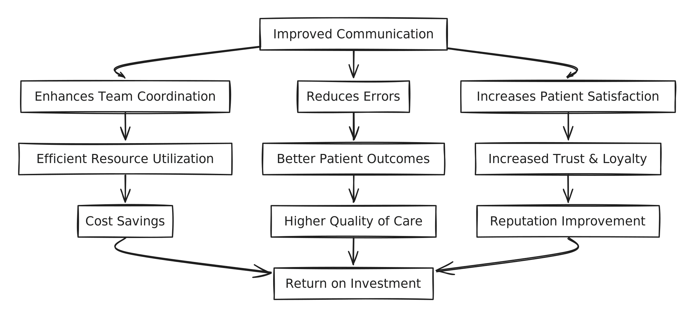

# Guide de configuration

## À quoi puis-je m'attendre comme charge de pilotage

La configuration et le déploiement dépend de la grosseur de votre organisation.

Par exemple, pour une petite organisation d'une trentaine de cliniciens, son implantation demande seulement quelques heures de travail.


Si vous utilisez Braver via un partenaire d'intégration (p.ex. Leomed ou Gustav), la configuration et le déploiement sont grandement simplifiés puisque plusieurs éléments de configuration sont automatisé à partir de la configuration du logiciel partenaire.


## Les concepts de Braver

Avant de débuter la configuration de la plateforme, nous recommandons de vous familiariser avec les concepts de Braver qui vous servirons dans la définition de votre structure organisationnelle.

Le schéma ci-dessous représente la hiérarchie des concepts dans Braver qui permettent de configurer votre structure organisationnelle.

Pour aller plus en profondeur dans les concepts

Voici des sections de la documentation qui pourrait vous être utiles:

* [Organisation](https://app.gitbook.com/s/C7asQvRtcnnGS2hUcyO0/pour-les-administrateurs/organisation)
* [Unités organisationnelles](https://app.gitbook.com/s/C7asQvRtcnnGS2hUcyO0/pour-les-administrateurs/unites-organisationnelles)
* [Lieux de travail](https://app.gitbook.com/s/C7asQvRtcnnGS2hUcyO0/pour-les-administrateurs/lieux-de-travail)
* [Équipes](https://app.gitbook.com/s/C7asQvRtcnnGS2hUcyO0/pour-les-administrateurs/equipes)
* Segments (à venir)
* [Utilisateurs](https://app.gitbook.com/s/C7asQvRtcnnGS2hUcyO0/pour-les-administrateurs/utilisateurs)
* [Journaux d'audit](https://app.gitbook.com/s/C7asQvRtcnnGS2hUcyO0/pour-les-administrateurs/journaux-daudit)
* Bottin (à venir)

## Configurer Braver

Prêt à commencer votre configuration? Cliquez sur ce qui convient à votre organisation:

<table data-view="cards"><thead><tr><th></th><th></th><th data-hidden data-card-cover data-type="files"></th><th data-hidden data-card-target data-type="content-ref"></th></tr></thead><tbody><tr><td>Je déploie Braver de</td><td><strong>manière autonome</strong></td><td><a href="../../.gitbook/assets/braver (1).png">braver (1).png</a></td><td><a href="je-deploie-braver-en-version-autonome.md">je-deploie-braver-en-version-autonome.md</a></td></tr><tr><td>Je déploie Braver via</td><td><strong>Leomed</strong></td><td><a href="../../.gitbook/assets/leomed.png">leomed.png</a></td><td><a href="../../integrations/leomed/je-deploie-braver-via-la-plateforme-leomed.md">je-deploie-braver-via-la-plateforme-leomed.md</a></td></tr><tr><td>Je déploie Braver via</td><td><strong>Gustav</strong></td><td><a href="../../.gitbook/assets/gustab.png">gustab.png</a></td><td><a href="../../integrations/gustav/je-deploie-braver-via-la-plateforme-gustav.md">je-deploie-braver-via-la-plateforme-gustav.md</a></td></tr></tbody></table>

## Le module patient et proche aidant

Si vous prévoyez utiliser le module patient et proche aidant via des appareils mobiles (ex: tablette) fournis et gérés par votre organisation, voici [un document pour vous guider dans le choix des appareils et certains éléments à considérer.](https://support.braver.net/pour-les-administrateurs/appareil-mobile-gere-a-distance)

Si vous prévoyez utiliser le module patient et proche aidant en invitant ces derniers sur leurs appareils personnels (mobile ou ordinateur), nous recommandons de soutenir les personnes dans la création de leur compte. Si vous le faites en personne, assurez-vous d'avoir accès à un réseau Wifi ou des données cellulaires.

Nous avons également développer un outil de formation express pour les patients que vous pouvez utiliser en version électronique ou papier.

## Autres détails techniques

* [Informations sur la connectivité](https://support.braver.net/details-techniques/connectivite)
* [Informations sur la compatibilité des appareils](https://support.braver.net/details-techniques/compatibilite)
