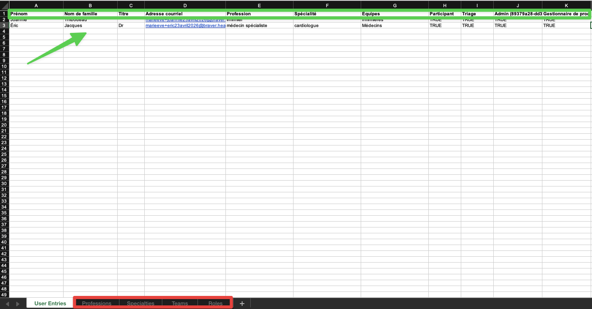

# Provisionner des utilisateurs en masse


Vous devez avoir le rôle « Admin » pour procéder à cette action.


## Pas-à-pas

* [Provisionner des utilisateurs en masse](provisionner-des-utilisateurs-en-masse.md#provisionner-des-utilisateurs-en-masse)
* [Supprimer des utilisateurs de la liste importée](provisionner-des-utilisateurs-en-masse.md#supprimer-des-utilisateurs-de-la-liste-importee)

### Provisionner des utilisateurs en masse


Une fois que les utilisateurs sont importés, il seront visibles par les membres de votre organisation et pourront être ajoutés aux fils de discussion. Ils recevront des courriels et pourront échanger en mode « Braver Connect » jusqu'à ce qu'ils optent pour créer leur compte.




**1) Cliquez sur votre avatar de profil, puis 2) sur&#x20;**_**Console administrative**_**.**

<figure><figcaption></figcaption></figure>




**Une fois dans la console administrative, cliquez sur&#x20;**_**Provisionnement des utilisateurs**_**.**

<figure><figcaption></figcaption></figure>




**Cliquez sur&#x20;**_**Télécharger le modèle**_**.**


Assurez-vous d'avoir fait l'étape 1: Créer les équipes et les lieux de travail dans la console administrative.



Si vous modifiez les équipes et les lieux de travail, téléchargez le modèle à nouveau et utilisez ce dernier.


<figure><figcaption></figcaption></figure>




**Remplissez les lignes du modèle dans la première feuille du classeur nommée&#x20;**_**User Entries**_**. Ne pas modifier les autres feuilles accessibles dans le classeur au bas de la page (voir encadré rouge).**


Dans les cases « TRUE » ou « FALSE », laissez une case vide équivaut à FALSE.


<figure><figcaption></figcaption></figure>




**1) Ajouter l'URL de l'émetteur SSO transmis par l'équipe Braver (facultatif) et 2) cliquez sur&#x20;**_**Téléverser la feuille de calcul**_**.**

<figure><figcaption></figcaption></figure>




**Si les voyants sont au vert, cliquez sur&#x20;**_**Provisionner les utilisateurs**_**.**&#x20;

<figure><figcaption></figcaption></figure>


**Si l'on vous indique des erreurs, révisez votre feuille de calcul et cliquez sur&#x20;**_**Recommencer**_**. Vous retournerez à l'étape 5 de ce pas-à-pas.**





**Cliquez sur&#x20;**_**Confirmer**_**.**

<figure><figcaption></figcaption></figure>




**On vous confirme le succès de votre action. Cliquez sur&#x20;**_**OK**_**.**

<figure><figcaption></figcaption></figure>




**Pour consulter l'état des créations de compte, cliquez sur&#x20;**_**Utilisateurs provisionné**_**s. Ceux qui figurent sans cet onglet et qui sont accompagnés d'un sablier n'ont pas encore créé leur compte Braver. Dès qu’un utilisateur va créer son compte, il sera déplacé dans la liste que l'on retrouve sous l'onglet&#x20;**_**Utilisateurs**_**.**


**RAPPEL:** Une fois que les utilisateurs sont importés, il seront visibles par les membres de votre organisation et pourront être ajoutés aux fils de discussion. Ils recevront des courriels et pourront échanger en mode « Braver Connect » jusqu'à ce qu'ils optent pour créer leur compte.


<figure><figcaption></figcaption></figure>




### Supprimer des utilisateurs de la liste importée



**Dans la console administrative, 1) cliquez sur&#x20;**_**Utilisateurs provisionnés**_**, puis 2) sélectionnez la poubelle sur la même ligne que l'utilisateur à supprimer.**

<figure><figcaption></figcaption></figure>




**Confirmez votre sélection en cliquant sur&#x20;**_**Supprimer**_**.**

<figure><figcaption></figcaption></figure>



