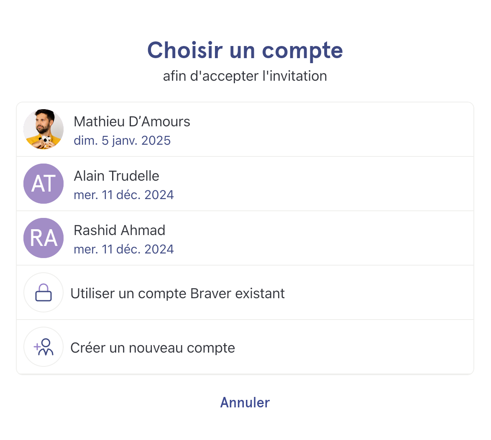
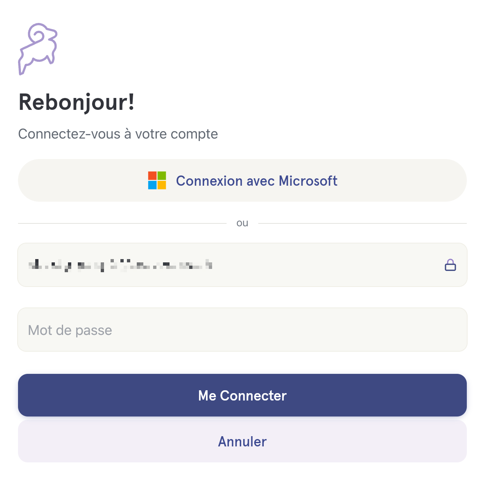
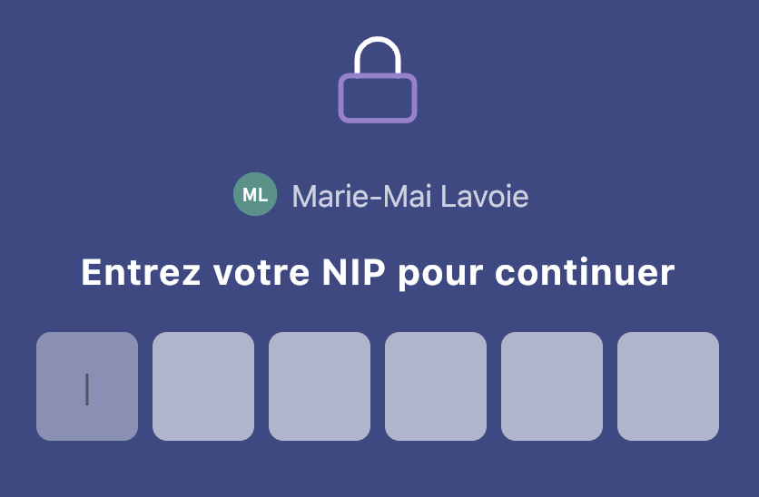

# Accepter une invitation à rejoindre son équipe de soins sur Braver

## Pas-à-pas


**Vous utiliserez Braver sur un cellulaire ou une tablette?** [Installez l'application Braver](https://www.braver.net/fr/download/) sur votre appareil mobile, avant de passer à l'étape 1. Vous serez notifié lors d'un nouveau message et votre appareil sonnera si on vous appelle.

Si vous préférez utilisez Braver sur votre ordinateur, vous serez informé lors d'un nouveau message par courriel. Suivez les prochaines étapes sur votre ordinateur.


### Cas fréquent



**Dans le courriel que vous avez reçu, cliquez sur le bouton vous invitant à accepter l'invitation.**

<figure><figcaption></figcaption></figure>



**C'est la première fois que vous ouvrez Braver?**

Choisissez l'option "Créer un nouveau compte".

<figure><figcaption></figcaption></figure>


Ce n'est pas ce qui s'affiche à votre écran? [Cliquez ici.](accepter-une-invitation.md#autres-cas)




**Inscrivez votre adresse courriel et le mot de passe de votre choix. Sélectionnez ensuite&#x20;**_**Créer mon compte**_**.**

<figure><figcaption></figcaption></figure>



**Récupérez le code de sécurité à 6 chiffres dans vos courriels et saisissez-le dans le champ de texte prévu à cet effet.**

<figure><figcaption></figcaption></figure>



**Acceptez les conditions d'utilisation.**

Faites défiler jusqu'en bas de la page pour accepter

<figure><figcaption></figcaption></figure>




**Créez votre code de récupération en cliquant sur&#x20;**_**Débuter**_**.**

<figure><figcaption></figcaption></figure>



**Cliquez ensuite sur&#x20;**_**Créer mon code de récupération**_**. Il sera dans vos courriels.**


Vérifiez vos indésirables s'il n'apparaît pas dans votre boîte courriel!


<figure><figcaption></figcaption></figure>


Gardez ce code dans un lieu sécuritaire! Il vous servira si vous perdez votre mot de passe.




**Configurez un NIP qui vous servira à déverrouiller facilement votre application si vous n'avez pas l'option de reconnaissance faciale. Cliquez sur .**

<figure><figcaption></figcaption></figure>




**Entrez votre NIP et répétez-le une seconde fois.**

<figure><figcaption></figcaption></figure>




**Entrez le code secret de l'invitation ou répondez à la question secrète**


Vous devrez soit **répondre à une question de sécurité** ou **entrer un code secret à 12 chiffres** (p. ex. 1234-1234-1234).

S'il vous demande un code secret, vous le trouverez **sous le bouton d'invitation** dans le courriel d'invitation sur lequel vous avez cliqué dans l'[étape 1](accepter-une-invitation.md#dans-le-courriel-que-vous-avez-recu-cliquez-sur-le-bouton-vous-invitant-a-accepter-linvitation).


<figure><figcaption></figcaption></figure>




***

### Autres cas 

#### Cas 1:

Si c'est la première fois que vous ouvrez Braver, mais que Braver a déjà été utilisé par quelqu'un d'autre sur votre appareil, vous verrez un écran comme le suivant:

<figure><figcaption></figcaption></figure>

Vous pouvez alors choisir l'option _Créer un nouveau compte_ et continuer à [l'étape 3](accepter-une-invitation.md#cas-frequent). Si vous avez déjà créé un compte Braver dans le passé, vous devriez cliquer sur votre nom ou sur _Utiliser un compte Braver existant_, puis passer à [l'étape 10](accepter-une-invitation.md#cas-frequent) directement.

#### Cas 2:

Si vous avez déjà créé votre compte dans le passé avec la même adresse courriel que celle de l'invitation, mais que votre session n'est pas déjà active sur votre appareil, vous verrez un écran comme le suivant:

<figure><figcaption></figcaption></figure>

Dans ce cas, vous devriez entrer votre mot de passe et passer à [l'étape 10](accepter-une-invitation.md#cas-frequent).

#### Cas 3:

Si vous avez déjà créé votre compte dans le passé avec la même adresse courriel que celle de l'invitation, et que votre session est déjà active sur votre appareil, vous verrez un écran comme le suivant:

<figure><figcaption></figcaption></figure>

Dans ce cas, vous devriez simplement entrer votre NIP afin de passer à [l'étape 10](accepter-une-invitation.md#cas-frequent).
