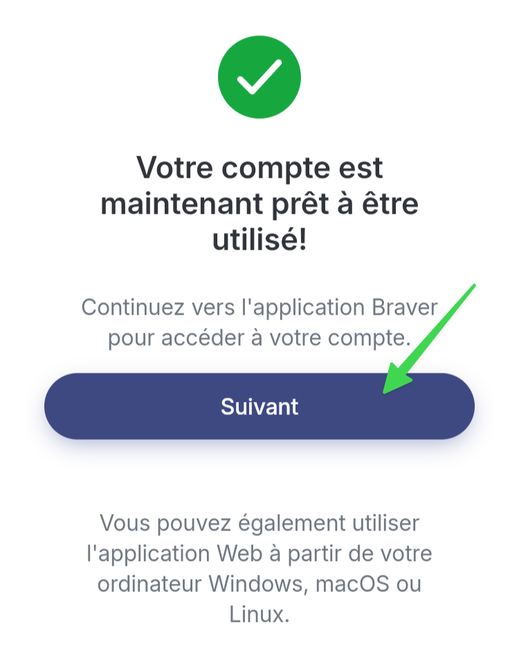
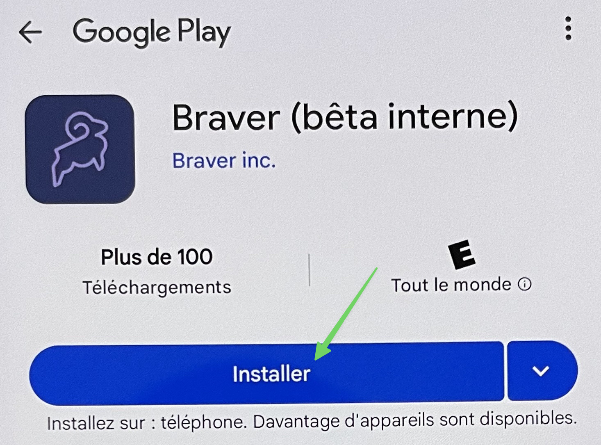
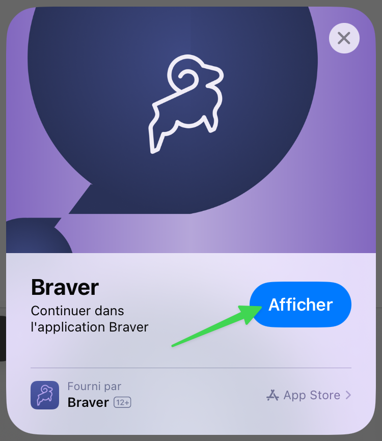
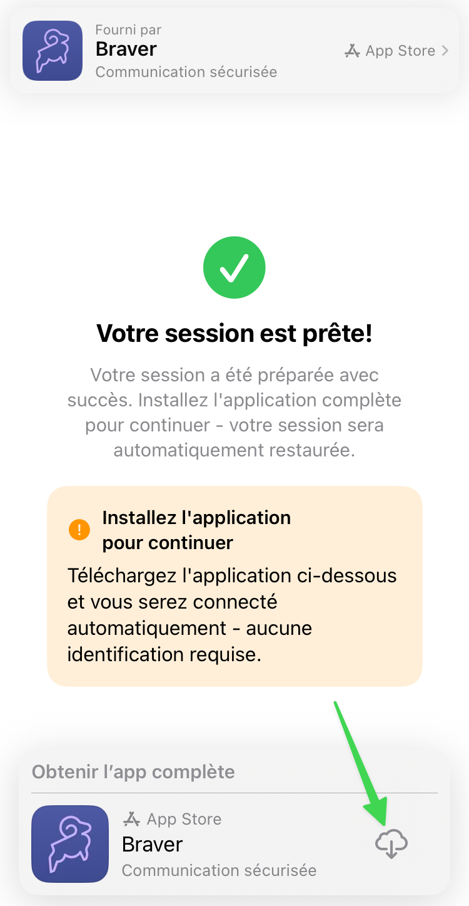
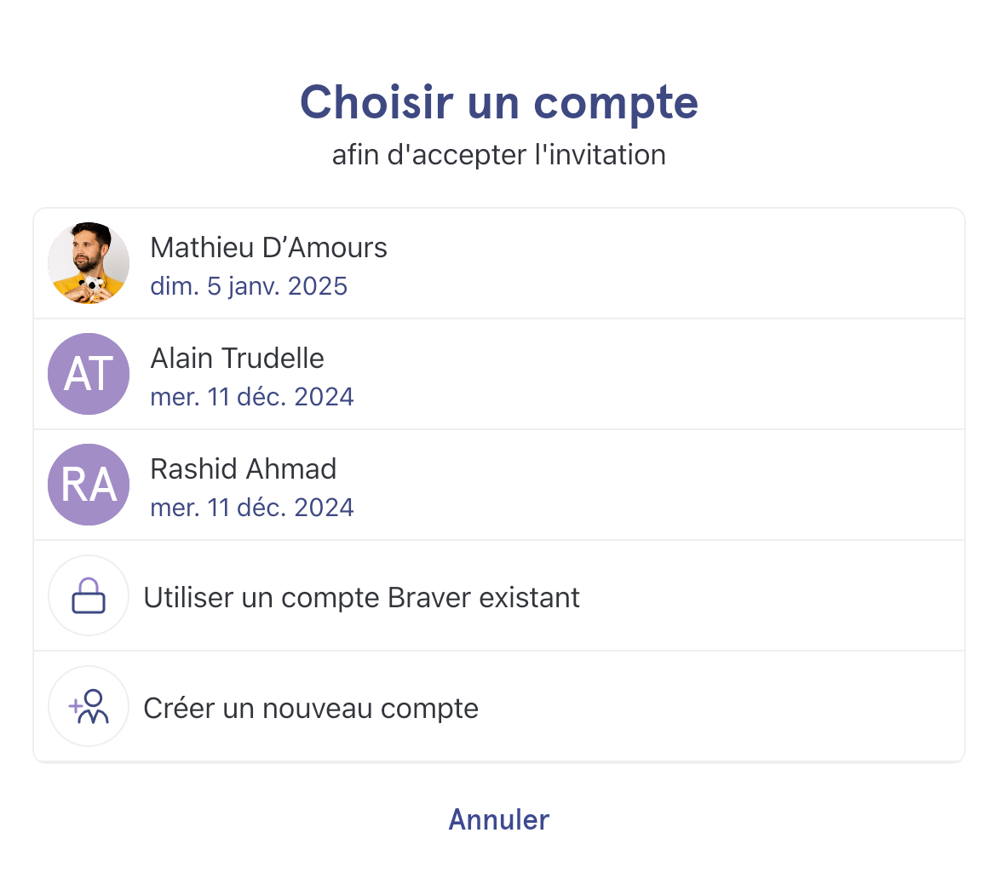
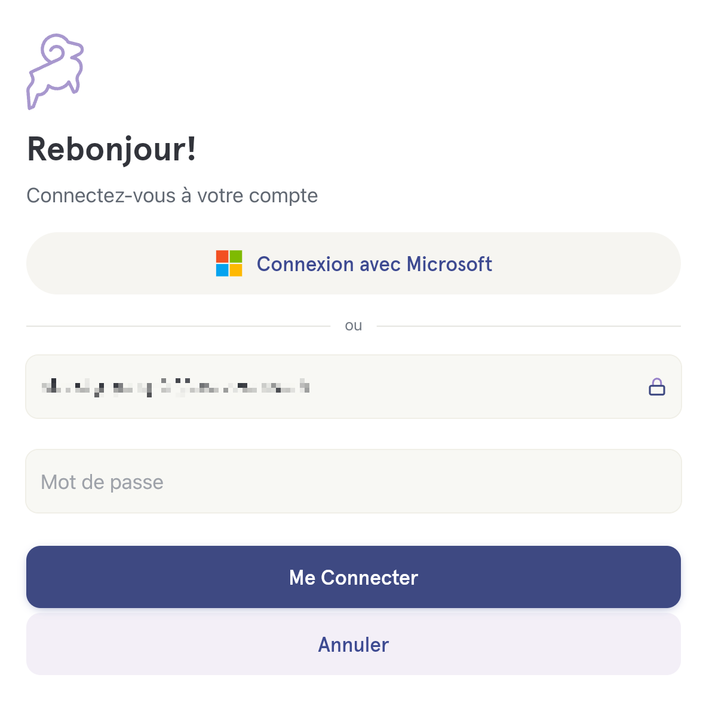
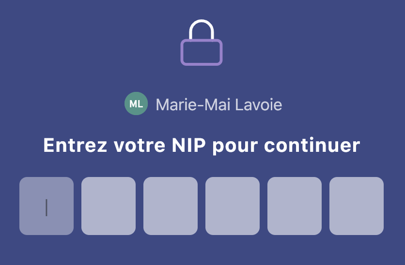

# Accepter une invitation à rejoindre son équipe de soins sur Braver

## Pas-à-pas


Il est possible de créer son compte autant sur un appareil mobile (cellulaire, tablette) que sur un ordinateur. Par ailleurs, il est possible que vous ayez reçu une invitation par SMS ou par courriel.


### Cas fréquent



**Dans le courriel que vous avez reçu, cliquez sur le bouton vous invitant à accepter l'invitation.**&#x20;


**📱Si vous avez été invité par SMS, cliquez sur le lien d'invitation sécurisé.**


<figure><figcaption></figcaption></figure>



**C'est la première fois que vous ouvrez Braver?** Choisissez l'option _Créer un nouveau compte_.


Ce n'est pas ce qui s'affiche à votre écran? [Cliquez ici.](accepter-une-invitation.md#autres-cas)


<figure><figcaption></figcaption></figure>



**Choisissez le mot de passe de votre choix et répétez-le. Sélectionnez ensuite&#x20;**_**Créer mon compte**_**.**&#x20;


**📱Si vous avez été invité par SMS, remplissez également le champ du courriel. Nous vous enverrons un code secret pour valider qu'il s'agit bien de votre courriel. (Voir étape suivante)**


<figure><figcaption></figcaption></figure>




**📱Si vous avez été invité par SMS, récupérez le code de sécurité à 6 chiffres dans vos courriels et saisissez-le dans le champ de texte prévu à cet effet.**


<figure><figcaption></figcaption></figure>



**Acceptez les conditions d'utilisation.** Faites défiler jusqu'en bas de la page pour accepter.

<figure><figcaption></figcaption></figure>




**Configurez un NIP qui vous servira à déverrouiller facilement votre application. Cliquez sur&#x20;**_**Configurer**_**.**

<figure><figcaption></figcaption></figure>




**Configurez votre NIP et répétez-le une seconde fois. Passez à l'étape 10 si vous êtes sur un ordinateur.**

<figure><figcaption></figcaption></figure>




### Vous voilà dans Braver!


**📱**Si vous êtes sur un appareil mobile (cellulaire ou tablette), vous devez télécharger l'application pour poursuivre.&#x20;

* Android, poursuivez [en cliquant ici](accepter-une-invitation.md#android).&#x20;
* iOS, poursuivez [en cliquant ici](accepter-une-invitation.md#ios-telechargez-lapplication).


<figure><figcaption></figcaption></figure>



### 📱Android: Téléchargez l'application


9.1 📱Appareil mobile **Android** (cellulaire ou tablette), cliquez sur _Suivant._


<figure><figcaption></figcaption></figure>


9.2📱Appareil mobile **Android** (cellulaire ou tablette), cliquez sur _Installer._


<figure><figcaption></figcaption></figure>


9.3📱Appareil mobile **Android** (cellulaire ou tablette), cliquez sur Ouvri&#x72;_._ **Vous voilà dans Braver!**


<figure><figcaption></figcaption></figure>



### 📱iOS: Téléchargez l'application


10.1📱Appareil mobile **iOS** (cellulaire ou tablette), cliquez sur _Suivant._


<figure><figcaption></figcaption></figure>


10.2📱Appareil mobile **iOS** (cellulaire ou tablette), cliquez sur _Ouvrir._


<figure><figcaption></figcaption></figure>


10.3📱Appareil mobile **iOS** (cellulaire ou tablette), cliquez sur _Afficher._


<figure><figcaption></figcaption></figure>


10.4📱Appareil mobile **iOS** (cellulaire ou tablette), cliquez sur _ce_ bouton. **Vous voilà dans Braver!**


<figure><figcaption></figcaption></figure>



***

### Autres cas 

#### Cas 1:

Si c'est la première fois que vous ouvrez Braver, mais que Braver a déjà été utilisé par quelqu'un d'autre sur votre appareil, vous verrez un écran comme le suivant:

<figure><figcaption></figcaption></figure>

Vous pouvez alors choisir l'option _Créer un nouveau compte_ et continuer à [l'étape 4](accepter-une-invitation.md#pas-a-pas). Si vous avez déjà créé un compte Braver dans le passé, vous devriez cliquer sur votre nom ou sur _Utiliser un compte Braver existant_, puis entrer vos informations de connection.

#### Cas 2:

Si vous avez déjà créé votre compte dans le passé avec la même adresse courriel que celle de l'invitation, mais que votre session n'est pas déjà active sur votre appareil, vous verrez un écran comme le suivant:

<figure><figcaption></figcaption></figure>

Dans ce cas, vous devriez entrer votre mot de passe afin de vous connecter.

#### Cas 3:

Si vous avez déjà créé votre compte dans le passé avec la même adresse courriel que celle de l'invitation, et que votre session est déjà active sur votre appareil, vous verrez un écran comme le suivant:

<figure><figcaption></figcaption></figure>

Dans ce cas, vous devriez simplement entrer votre NIP afin de vous connecter.
