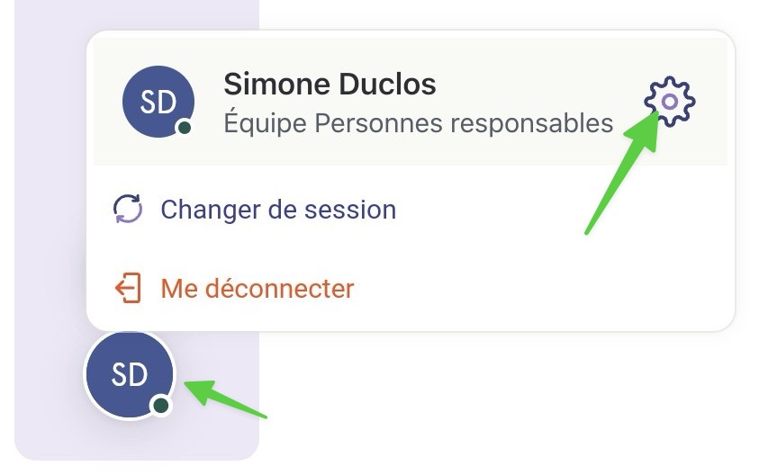

# Modifier sa photo

## Pas-à-pas



**Débutez en naviguant à votre profil en bas de l'écran.**


Sur un téléphone mobile, vous devez appuyer sur l'icône de roue en bas de l'écran.


<figure><figcaption></figcaption></figure>




#### D'ici, vous pouvez modifier votre photo de profil visible aux autres utilisateurs

<figure><figcaption></figcaption></figure>



