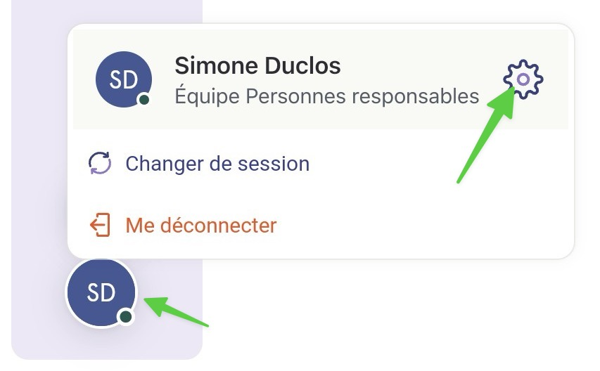

# Générer un nouveau code de récupération

## Pas-à-pas



**Débutez en naviguant à votre profil en bas de l'écran.**


Sur un téléphone mobile, vous devez appuyer sur l'icône de roue en bas de l'écran.


<figure><figcaption></figcaption></figure>




#### Sélectionnez l’onglet _Paramètres_.

<figure><figcaption></figcaption></figure>




#### Sous la section Sécurité, cliquez sur _Générer un code de récupération_.

<figure><figcaption></figcaption></figure>




#### Suivez les instructions


