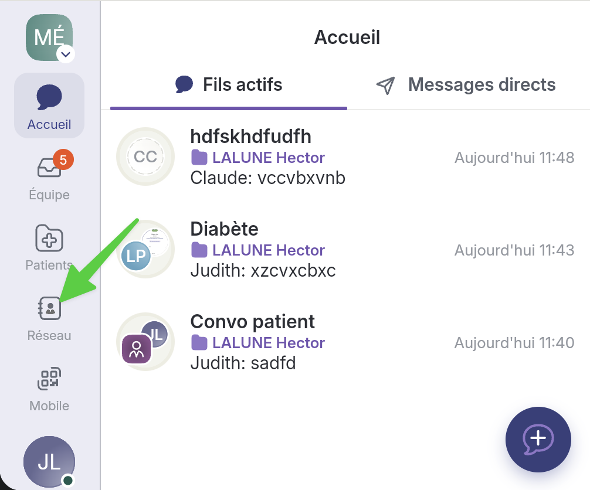
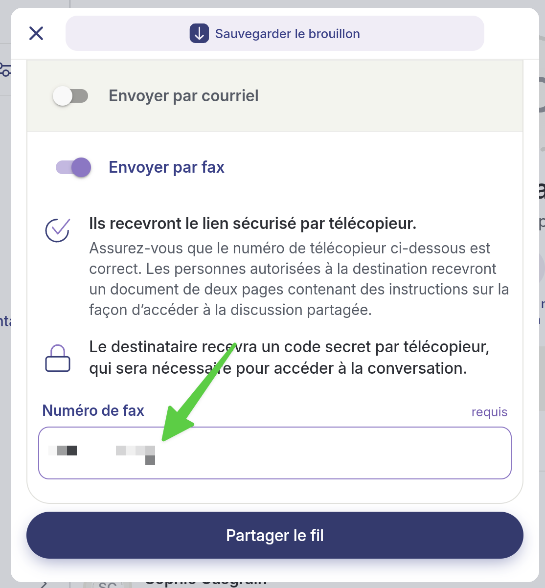
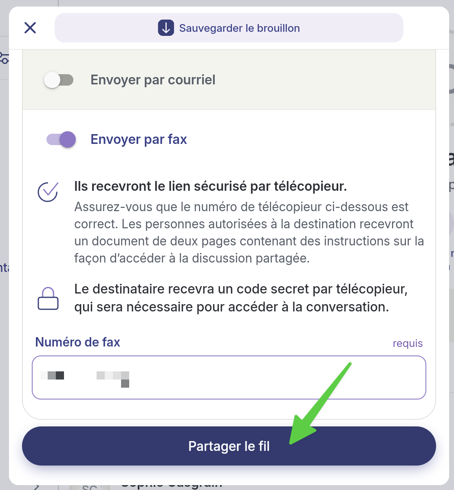

# Contacter un professionnel qui n'a pas de compte Braver

## Pas-à-pas

* [Créer un contact Braver Connect](contacter-un-professionnel-qui-na-pas-de-compte-braver.md#creer-un-contact-braver-connect)
  * [Ajouter un lieu de travail](contacter-un-professionnel-qui-na-pas-de-compte-braver.md#ajouter-un-lieu-de-travail)
* [Partager un fil à un contact Braver Connect par courriel](contacter-un-professionnel-qui-na-pas-de-compte-braver.md#partager-un-fil-a-un-contact-braver-connect-par-courriel)
* [Partager un fil à un contact Braver Connect par fax](contacter-un-professionnel-qui-na-pas-de-compte-braver.md#partager-un-fil-a-un-contact-braver-connect-par-fax)

### Créer un contact Braver Connect



**Accédez à la page Réseau.**

<figure><figcaption></figcaption></figure>


Ce pas-à-pas vous démontre comment créer un contact Braver Connect à partir de la page Réseau. Puisqu'il existe plusieurs chemins afin d'y parvenir, vous pourriez également créer ce type de contact lors de la rédaction d'un fil de discussion: Ajouter un participant > Ajouter un contact.





**Si c'est la première fois que vous collaborez avec cette personne, cliquez sur&#x20;**_**Ajouter un contact**_**.**

<figure><figcaption></figcaption></figure>




**Remplissez le formulaire&#x20;**_**Ajouter une personne externe:**_

1. Son titre
2. Son prénom
3. Son nom de famille
4. Son adresse courriel


Adresse courriel: Activez le sélecteur sous le courriel s'il s'agit d'une adresse générale advenant le cas que vous ne connaissiez pas le courriel du contact que vous souhaitez ajouter.


5. Sa profession
6. Son lieu de travail ([Accédez au pas-à-pas de cette action dans la section _Ajouter un lieu de travail_.](contacter-un-professionnel-qui-na-pas-de-compte-braver.md#ajouter-un-lieu-de-travail))


Invitez maintenant: Laissez le sélecteur inactif.


<figure><figcaption></figcaption></figure>




**Cliquez sur&#x20;**_**Créer un contact externe**_**.**

<figure><figcaption></figcaption></figure>




**Une fois votre contact créé, il apparaît dans votre page Réseau. Le contour de son avatar est en pointillé, car il n'a pas encore de compte Braver.**

<figure><figcaption></figcaption></figure>




### Partager un fil à un contact Braver Connect par courriel



**Les avatars de vos contacts « Braver Connect » s'afficheront en pointillés dans la page réseau. 1) Cliquez sur ce contact, puis 2) sur&#x20;**_**Nouveau fil**_**.**

<figure><figcaption></figcaption></figure>


Il existe plusieurs chemins pour écrire à un contact Braver Connect. Vous pourriez également démarrer un fil de discussion à partir de la page _Accueil_. Lorsque vous ajouterez des participants au fil, vous pourrez sélectionner votre contact Braver Connect de la même manière que vos contacts « régulier ».





**Activez l'option&#x20;**_**Envoyer par courriel**_**.**

<figure><figcaption></figcaption></figure>




**Le courriel que vous avez indiquez lorsque vous avez rempli le le formulaire&#x20;**_**Ajouter une personne externe**_**, s'affiche déjà dans le bon champ.**

<figure><figcaption></figcaption></figure>




**Activez l'interrupteur sous le courriel s'il s'agit d'une adresse générale advenant le cas que vous ne connaissiez pas le courriel du contact que vous souhaitez ajouter.**

<figure><figcaption></figcaption></figure>




**Par défaut, la personne qui reçoit un courriel Braver Connect reçoit un code secret à utiliser comme mot de passe. Si vous préférez utiliser une question de sécurité et sa réponse, activez l'option suivante:**


Si vous avez activé l'interrupteur mentionnant que « Ce courriel identifie une entreprise ou une organisation, plutôt qu'une personne », vous ne pourrez pas utiliser une question de sécurité et sa réponse.


<figure><figcaption></figcaption></figure>




1. **Inventez une question de sécurité pour votre destinataire.**
2. **Inscrivez la réponse à cette question.**
3. **Répétez la réponse pour la valider.**

<figure><figcaption></figcaption></figure>




**Cliquez sur partager le fil.**

<figure><figcaption></figcaption></figure>




**Complétez le fil de discussion comme vous le faites habituellement. Dans les participants, vous verrez le contact Braver Connect. Ajoutez les participants manquants au besoin. Cliquez sur&#x20;**_**Envoyer**_**.**

<figure><figcaption></figcaption></figure>




### Partager un fil à un contact Braver Connect par fax


Le fax contient les informations suivantes:

* Votre nom et votre profession
* Votre lieu de travail et son adresse
* Le nom de la personne à qui le fax est destiné ainsi que sa profession
* Son lieu de travail et son adresse
* Le no du fax
* Les initiales du patient et son âge (s'il s'agit d'un fil clinique)
* Les instructions pour intégrer le fil de discussion. Il existe 2 possibilités:
  * Soit en scannant un code QR
  * Soit en naviguant vers un URL




**Les avatars de vos contacts « Braver Connect » s'afficheront en pointillés dans la page réseau. 1) Cliquez sur ce contact, puis 2) sur&#x20;**_**Nouveau fil**_**.**

<figure><figcaption></figcaption></figure>


Il existe plusieurs chemins pour écrire à un contact Braver Connect. Vous pourriez également démarrer un fil de discussion à partir de la page _Accueil_. Lorsque vous ajouterez des participants au fil, vous pourrez sélectionner votre contact Braver Connect de la même manière que vos contacts « régulier ».





**Activez l'option&#x20;**_**Envoyer par fax**_**.**

<figure><figcaption></figcaption></figure>




**Ajoutez le numéro du fax dans le bon champ.**

<figure><figcaption></figcaption></figure>




**Cliquez sur&#x20;**_**Partager le fil**_**.**

<figure><figcaption></figcaption></figure>




**Complétez le fil de discussion comme vous le faites habituellement. Dans les participants, vous verrez le contact Braver Connect. Ajoutez les participants manquants au besoin. Cliquez sur&#x20;**_**Envoyer**_**.**

<figure><figcaption></figcaption></figure>




### Ajouter un lieu de travail



**Cliquez sur&#x20;**_**Choisir un lieu de travail**_**.**

<figure><figcaption></figcaption></figure>




**Faites une recherche afin de vérifier si le lieu de travail existe déjà dans le réseau Braver.**

<figure><figcaption></figcaption></figure>




**S'il existe, sélectionnez-le dans le menu. Sinon, passez à l'étape 5.**

<figure><figcaption></figcaption></figure>




**Cliquez sur&#x20;**_**Choisir lieu de travail.**_**&#x20;Le lieu de travail a bien été ajouté. Vous n'avez pas besoin de suivre les prochaines étapes de ce pas-à-pas.**

<figure><figcaption></figcaption></figure>




**Si le lieu de travail n'a pas encore été créé dans Braver, cliquez sur&#x20;**_**Créer un nouveau lieu de travail**_**.**

<figure><figcaption></figcaption></figure>




**1) Inscrivez le lieu de travail que vous souhaitez créer dans la boîte de recherche au haut de la page. Un ou plusieurs choix provenant de Google Maps apparaîtront dans le menu, sous la barre de recherche. 2) Sélectionnez celui qui vous convient.**


Il est également possible d'entrer une adresse manuellement. Voir encadré vert sur l'image ci-dessous.


<figure><figcaption></figcaption></figure>




**Vous pouvez 1) ajouter une unité si désiré, puis 2) cliquez sur suivant.**

<figure><figcaption></figcaption></figure>




**Sélectionnez une catégorie provenant du menu déroulant.**

<figure><figcaption></figcaption></figure>




**Cliquez sur&#x20;**_**Suivant**_**.**

<figure><figcaption></figcaption></figure>




**Validez les information et cliquez sur&#x20;**_**Créer lieu de travail**_**.**

<figure><figcaption></figcaption></figure>




