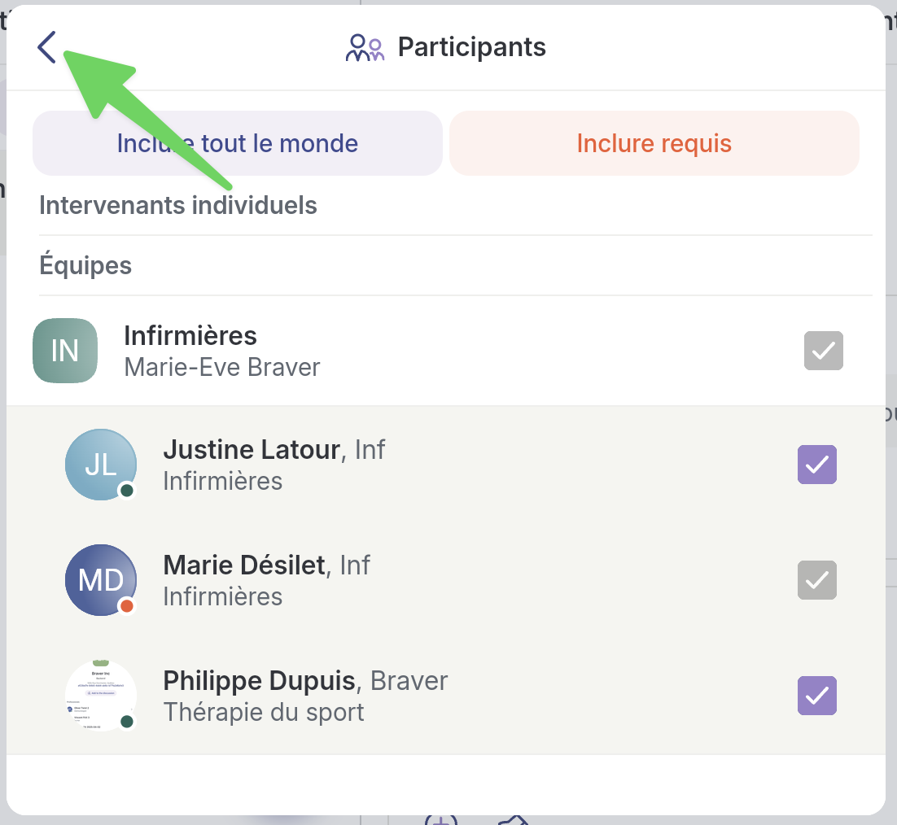

# Créer un fil de discussion clinique dans un canal de soins existant

## Pas-à-pas



**Accédez à la page&#x20;**_**Patients.**_

<figure><figcaption></figcaption></figure>




**1) Sélectionnez le patient qui vous intéresse OU 2) retrouvez-le grâce à la barre de recherche.**

<figure><figcaption></figcaption></figure>




**Dans la fiche du patient, dans le canal de soins souhaité, cliquez sur l'icône d'ajout d'un fil de discussion.**

<figure><figcaption></figcaption></figure>




**1) Inscrivez un titre, 2) le message de votre choix et 3) ajoutez du contenu. 4) Cliquez sur suivant.**&#x20;

<figure><figcaption></figcaption></figure>




**Vous pouvez modifier les participants que vous souhaitez notifier. Cliquez sur&#x20;**_**Modifier**_**.**

<figure><figcaption></figcaption></figure>




**Sélectionnez les personnes ou les équipes à retirer.**


Ici, on voit que l'équipe des infirmières est grisée parce que l'auteur du message en fait partie et ne peut donc pas se retirer en tant que participant du message.



Il est important de comprendre que les personnes que vous avez retirées de la discussion ne seront pas notifiées, **mais auront accès au contenu du fil dans le canal de soins.**


<figure><figcaption></figcaption></figure>




**Revenez à la page d'envoi.**

<figure><figcaption></figcaption></figure>




**Cliquez sur&#x20;**_**Envoyer**_**.**

<figure><figcaption></figcaption></figure>



