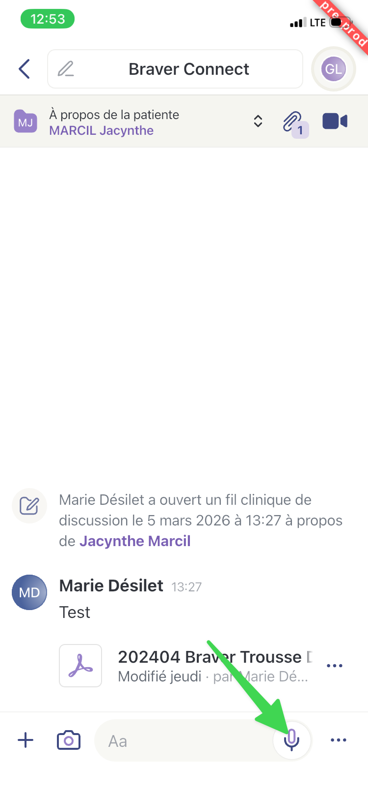

# Ajouter un message vocal à une discussion

## Pas-à-pas


Cette fonctionnalité est disponible seulement sur mobile.




**Accédez à la page&#x20;**_**Accueil.**_

<figure><figcaption></figcaption></figure>




**Sélectionnez le fil de discussion dans lequel vous désirez transmettre un message vocal.**

<figure><figcaption></figcaption></figure>




**Cliquez sur l'icône du micro pour débuter l'enregistrement.**

<figure><figcaption></figcaption></figure>




**Lorsque vous êtes prêt, cliquez sur l'icône du micro.&#x20;**_**Vous n'avez pas à le maintenir appuyé**_**.**


Avant d'initier l'enregistrement, vous pouvez également choisir la langue de votre choix (anglais ou français).


<figure><figcaption></figcaption></figure>




**Enregistrez votre message, puis cliquez sur le bouton orange d'arrêt.**

<figure><figcaption></figcaption></figure>




**Vous pouvez maintenant modifier le texte à votre guise.**

1. Si vous désirez reprendre votre enregistrement, sélectionnez la flèche qui fait un retour en arrière (à gauche).
2. Pour vous écouter, appuyez sur l'icône « Jouer » (au centre).
3. Pour l'envoyer, cliquez sur l'avion en papier (à droite).

<figure><figcaption></figcaption></figure>




**Votre interlocuteur pourra alors vous écouter ou lire votre retranscription.**

<figure><figcaption></figcaption></figure>



