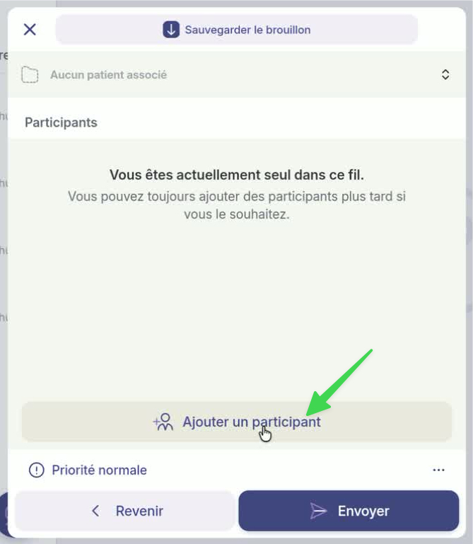
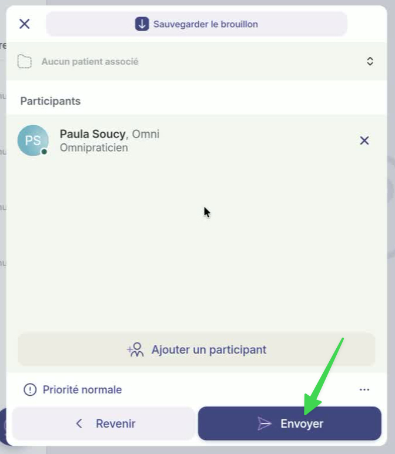

# Créer un nouveau fil de discussion non clinique

## Pas-à-pas



**Accédez à la page&#x20;**_**Accueil**_**.**

<figure><figcaption></figcaption></figure>




**Appuyez sur le bouton de création de discussion dans le bas de la page.**

<figure><figcaption></figcaption></figure>




**Choisissez le&#x20;**_**Fil non clinique**_**.**

<figure><figcaption></figcaption></figure>




**Dans le menu de rédaction :**

1. **Indiquez un titre pour votre message.**
2. **Rédigez le contenu du message.**
3. **Cliquez sur « pièces jointes » pour ajouter des fichiers si nécessaire.**
4. **Définissez la priorité comme urgente si besoin.**
5. **Cliquez sur « suivant » pour accéder à la deuxième page de rédaction.**

<figure><figcaption></figcaption></figure>




**Cliquez sur « ajouter un participant ».**

<figure><figcaption></figcaption></figure>




1. **Utilisez la barre de recherche pour trouver les participants souhaités.**
2. **Cliquez sur le nom de la personne que vous désirez ajouter.**

<figure><figcaption></figcaption></figure>




**Après avoir sélectionné le participant, cliquez sur « Ajouter à la discussion ».**

<figure><figcaption></figcaption></figure>


**Si vous désirez impliquer une équipe au fil non clinique, sélectionnez un lieu de travail. Vous pouvez utiliser la loupe comme à l'étape 6.**

**1) Cliquez directement sur « Ajouter à la discussion»  dans le haut du lieu de travail. 2) Sélectionnez ensuite l'équipe nécessaire.**





**Cliquez sur « envoyer » en bas de la page.**

<figure><figcaption></figcaption></figure>


Si vous cliquez sur _Aucun patient associé_, vous pourrez transformer le fil non clinique en fil clinique.





**Où les retrouver :**

* Les _fils non cliniques_ sont accessibles à partir de l'onglet _Accueil_. Ce sont ceux qui ne sont pas reliés à une fiche patient en violet (voir image).
* Vous pouvez également retrouver les _fils non cliniques_ sous l'onglet _Réseau_, en sélectionnant l'un de vos collaborateurs à ce fil.



## Autre chemin pour créer un fil de discussion non clinique

Dans l'onglet _Réseau_ > Choisissez votre interlocuteur > Cliquez sur _Nouveau fil_

<figure><figcaption></figcaption></figure>

