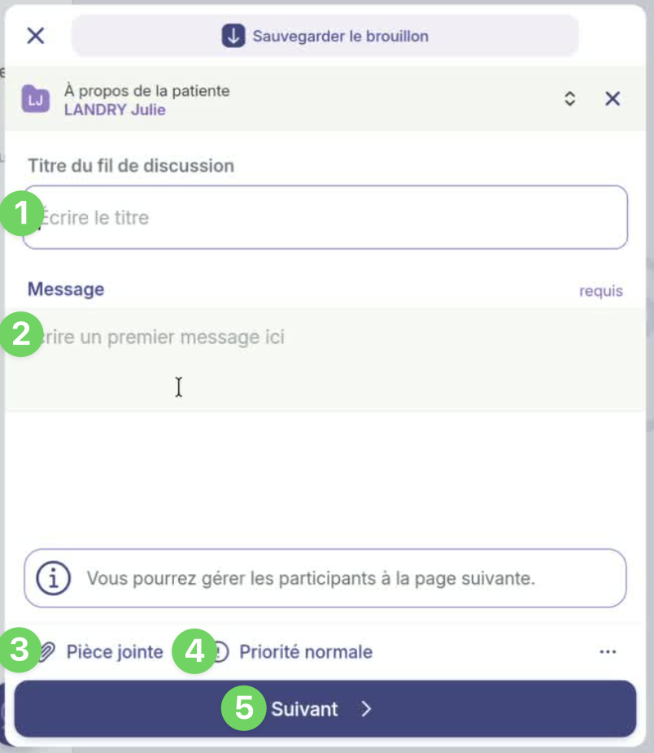
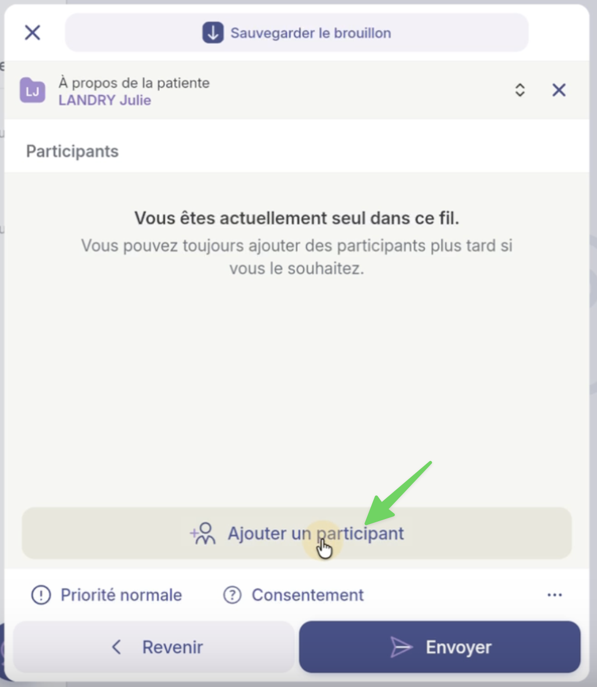
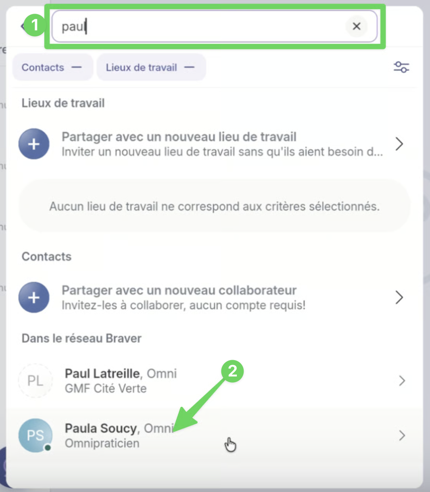

# Créer un nouveau fil de discussion non clinique

## Pas-à-pas

* [Scénario 1: Ajouter un ou des participants](creer-un-fil-de-discussion-non-clinique.md#scenario-1-ajouter-un-ou-des-participants)
* [Scénario 2: Ajouter une ou des équipes](creer-un-fil-de-discussion-non-clinique.md#scenario-2-ajouter-une-ou-des-equipes)
* [Autre chemin pour créer un fil de discussion non clinique](creer-un-fil-de-discussion-non-clinique.md#autre-chemin-pour-creer-un-fil-de-discussion-non-clinique)

## Scénario 1: Ajouter un ou des participants



**Accédez à la page&#x20;**_**Accueil**_**.**

<figure><figcaption></figcaption></figure>




**Sélectionnez la bulle dans le bas de la page.**

<figure><figcaption></figcaption></figure>




**Choisissez le&#x20;**_**Fil non clinique.**_

<figure><figcaption></figcaption></figure>




**Dans le menu de rédaction :**

1. **Indiquez un titre pour votre message.**
2. **Rédigez le contenu du message.**
3. **Cliquez sur&#x20;**_**Pièces jointes**_**&#x20;pour ajouter des fichiers si nécessaire.**
4. **Définissez la priorité comme urgente si besoin.**
5. **Cliquez sur&#x20;**_**Suivant**_**&#x20;pour accéder à la deuxième page de rédaction.**

<figure><figcaption></figcaption></figure>




**Cliquez sur&#x20;**_**Ajouter un participant**_**.**

<figure><figcaption></figcaption></figure>




1. **Utilisez la barre de recherche pour trouver les participants souhaités.**
2. **Cliquez sur le nom de la personne que vous désirez ajouter.**


Pour ajouter une équipe, consultez la section [_Scénario 2: Ajouter une ou des équipes_](creer-un-fil-de-discussion-non-clinique.md#scenario-2-ajouter-une-ou-des-equipes) de cette page.


<figure><figcaption></figcaption></figure>




**Après avoir sélectionné le participant, cliquez sur&#x20;**_**Ajouter à la discussion**_**.**

<figure><figcaption></figcaption></figure>




**Cliquez sur&#x20;**_**Envoyer**_**&#x20;en bas de la page.**

<figure><figcaption></figcaption></figure>





**Où les retrouver :**

* Les _fils non cliniques_ sont accessibles à partir de l'onglet _Accueil_. Ce sont ceux qui ne sont pas reliés à une fiche patient en violet (voir image).
* Vous pouvez également retrouver les _fils non cliniques_ sous l'onglet _Réseau_, en sélectionnant l'un de vos collaborateurs à ce fil.



## Scénario 2: Ajouter une ou des équipes



**À l'étape 6 du scénario 1, cliquez sur le lieu de travail où se trouve votre équipe:**

1. **Utilisez la barre de recherche pour trouver le lieu de travail souhaité.**
2. **Cliquez sur le nom du lieu de travail où se trouve l'équipe que vous désirez ajouter.**

<figure><figcaption></figcaption></figure>




**Après avoir sélectionné le lieu de travail, cliquez sur&#x20;**_**Ajouter à la discussion**_**.**

<figure><figcaption></figcaption></figure>




**Cliquez sur le nom de l'équipe que vous désirez ajouter.**

<figure><figcaption></figcaption></figure>




**Cliquez sur&#x20;**_**Envoyer**_**&#x20;en bas de la page.**

<figure><figcaption></figcaption></figure>




## Autre chemin pour créer un fil de discussion non clinique

**1) Dans la page&#x20;**_**Réseau, 2) c**_**hoisissez votre interlocuteur et 3) cliquez sur&#x20;**_**Nouveau fil.**_

<figure><figcaption></figcaption></figure>

