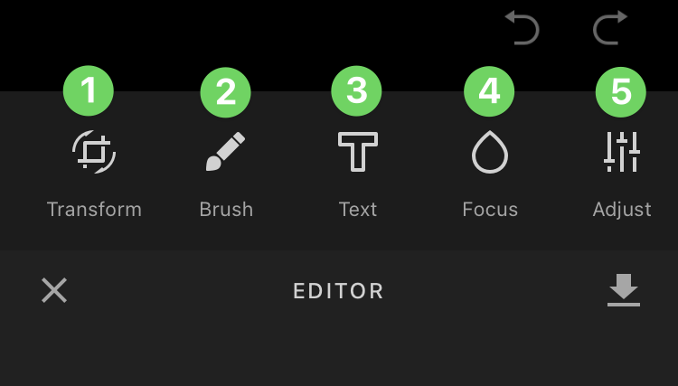
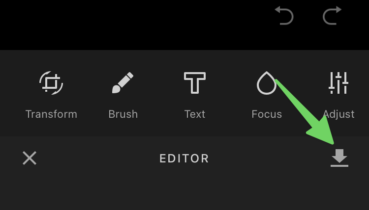

# Éditer une photo ou une vidéo


Pour l'instant, l'édition de photo et de vidéo est seulement possible sur un appareil mobile (iOS ou Android).


## Pas-à-pas



**1) Accédez à la page&#x20;**_**Accueil**_**, puis sélectionnez 2) le fil de discussion qui vous intéresse ou 3) créez un nouveau fil.**

<figure><figcaption></figcaption></figure>




**1) Joignez une photo (ou une vidéo) au fil de discussion ou 2) prenez une photo (ou une vidéo).**


Les photos prises ou vidéos enregistrées n'apparaîtront pas sur la pellicule de votre appareil.


<figure><figcaption></figcaption></figure>




**Accédez à l'outil de modification en cliquant sur l'image à envoyer.**

<figure><figcaption></figcaption></figure>




**Vous pouvez maintenant effectuer plusieurs types de modifications, dont :**

1. Transformer l'image (rogner, etc.)
2. Ajouter des traits à la brosse
3. Ajouter du texte
4. Modifier le focus
5. Ajuster l'image (couleurs, etc.)

<figure><figcaption></figcaption></figure>




**Une fois vos modifications terminées, cliquez sur la flèche de sauvegarde.**

<figure><figcaption></figcaption></figure>



