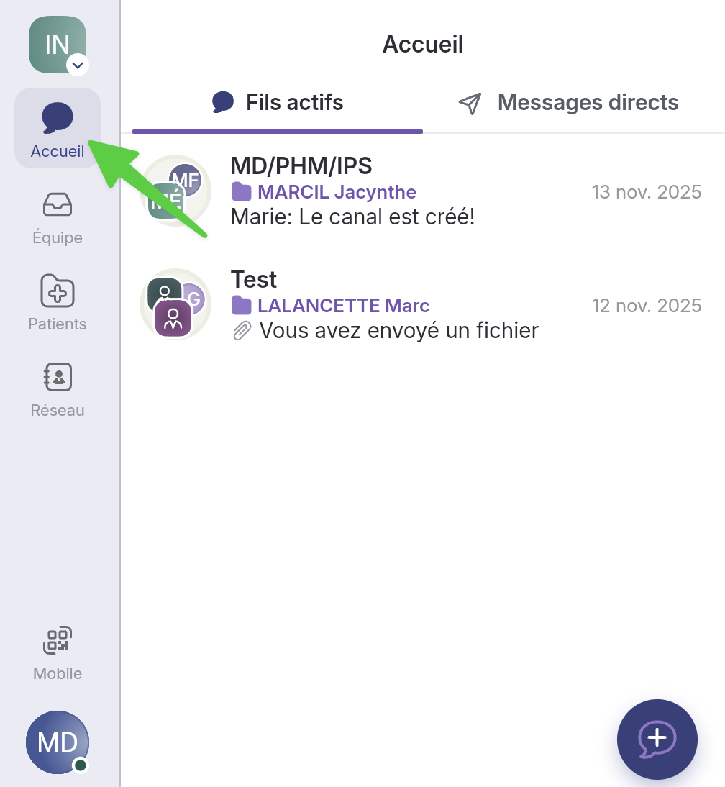

# Gérer les participants d'un fil de discussion

## Pas-à-pas&#x20;

* [Ajouter un participant à partir de son lieu de travail](gerer-les-participants-dun-fil-de-discussion.md#ajouter-un-participant-a-partir-de-son-lieu-de-travail)
* [Ajouter un participant en recherchant son nom](gerer-les-participants-dun-fil-de-discussion.md#ajouter-un-participant-en-recherchant-son-nom)
* [Ajouter une équipe](gerer-les-participants-dun-fil-de-discussion.md#ajouter-une-equipe)

### Ajouter un participant à partir de son lieu de travail



**Accédez à la page&#x20;**_**Accueil.**_

<figure><figcaption></figcaption></figure>




**Sélectionnez le fil de discussion actif de votre choix.**

<figure><figcaption></figcaption></figure>




**Cliquez dans le cercle présentant les participants, en haut, à droite de votre fil.**

<figure><figcaption></figcaption></figure>




**Si vous souhaitez ajouter un intervenant, cliquez sur&#x20;**_**Ajouter +**_**, à droite de la mention&#x20;**_**Intervenants individuels**_**.**

<figure><figcaption></figcaption></figure>




**Vous pouvez rechercher un participant en retrouvant son lieu de travail. Utilisez la barre de recherche dans le haut, au besoin. Cliquez sur le lieu de travail.**


Pensez à activer le filtre _Lieux de travail_, sinon il n'y aura que les contacts qui s'afficheront.


<figure><figcaption></figcaption></figure>




**Une fois dans le bon lieu de travail, cliquez sur l'équipe dans laquelle le participant prend part.**

<figure><figcaption></figcaption></figure>




**Cliquez sur la bonne personne.**

<figure><figcaption></figcaption></figure>




**Cliquez sur&#x20;**_**Ajouter à la discussion**_**.**

<figure><figcaption></figcaption></figure>




**Le nouveau participant est maintenant ajouté. S'il y a une enveloppe près de son nom, c'est qu'il n'a pas encore rejoint la discussion.**

<figure><figcaption></figcaption></figure>




### Ajouter un participant en recherchant son nom



**Accédez à la page&#x20;**_**Accueil.**_

<figure><figcaption></figcaption></figure>




**Sélectionnez le fil de discussion actif de votre choix.**

<figure><figcaption></figcaption></figure>




**Cliquez dans le cercle présentant les participants, en haut, à droite de votre fil.**

<figure><figcaption></figcaption></figure>




**Si vous souhaitez ajouter un intervenant, cliquez sur&#x20;**_**Ajouter +**_**, à droite de la mention&#x20;**_**Intervenants individuels**_**.**

<figure><figcaption></figcaption></figure>




**Vous pouvez utiliser la barre de recherche pour trouver un contact en particulier.**


Pensez à activer le filtre _Contacts_, sinon il n'y aura que les lieux de travail qui s'afficheront.


<figure><figcaption></figcaption></figure>




**Sélectionnez le participant que vous désirez ajouter au fil de discussion.**

<figure><figcaption></figcaption></figure>




**Cliquez sur&#x20;**_**Ajouter à la discussion**_**.**

<figure><figcaption></figcaption></figure>




**Le nouveau participant est maintenant ajouté. S'il y a une enveloppe près de son nom, c'est qu'il n'a pas encore rejoint la discussion.**

<figure><figcaption></figcaption></figure>




### Ajouter une équipe


Lorsque vous ajoutez une équipe, votre message s'inscrira dans leur [boîte de triage](https://support.braver.net/pour-les-administrateurs/equipes?q=boite+de+triage#boite-de-triage).




**Accédez à la page&#x20;**_**Accueil.**_&#x20;

<figure><figcaption></figcaption></figure>




**Sélectionnez le fil de discussion actif de votre choix.**

<figure><figcaption></figcaption></figure>




**Cliquez dans le cercle présentant les participants, en haut, à droite de votre fil.**

<figure><figcaption></figcaption></figure>




**Pour ajouter une équipe entière et que le message atterrisse dans leur boîte de triage, cliquez sur&#x20;**_**Ajouter +**_**&#x20;près de la mention&#x20;**_**Équipes**_**.**

<figure><figcaption></figcaption></figure>




**Utilisez la barre de recherche pour trouver le lieu de travail où l'équipe se trouve.**


Pensez à activer le filtre _Lieux de travail_, sinon il n'y aura que les contacts qui s'afficheront.


<figure><figcaption></figcaption></figure>




**Sélectionnez le lieu de travail où l'équipe se trouve.**

<figure><figcaption></figcaption></figure>




**Sous le lieu de travail, cliquez sur&#x20;**_**Ajouter à la discussion**_**.**

<figure><figcaption></figcaption></figure>




**À ce moment, on vous propose les équipes qu'il vous est possible d'ajouter à la discussion. Sélectionnez l'équipe de votre choix pour l'ajouter.**

<figure><figcaption></figcaption></figure>




**La nouvelle équipe est maintenant ajoutée.**

<figure><figcaption></figcaption></figure>



