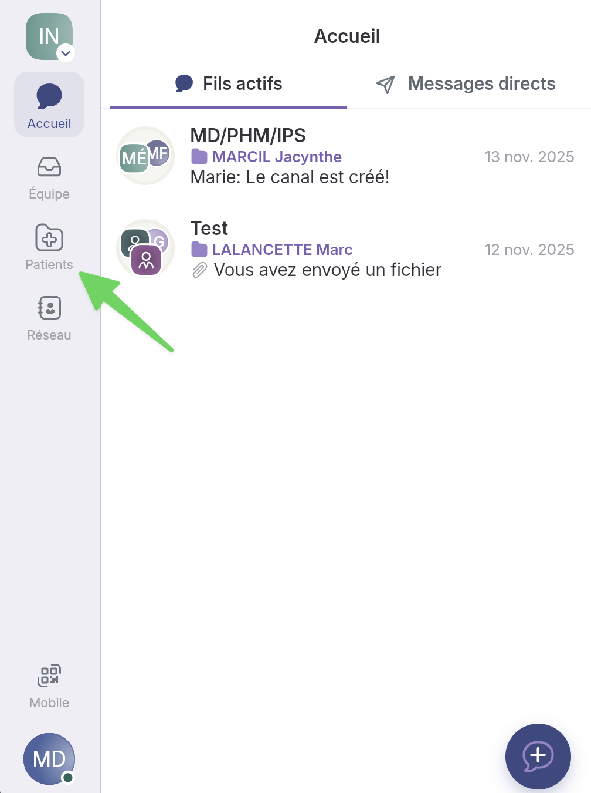
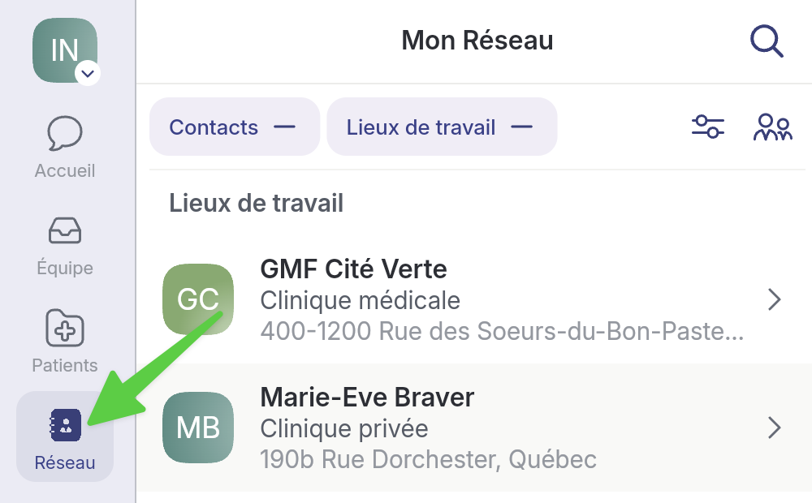

# Retrouver un fil de discussion fermé


Lorsqu'un fil de discussion est fermé, il devient un artefact immuable, mais toujours accessible et téléchargeable en PDF.


## Pas-à-pas

Les fils de discussion fermés se retrouvent dans la [page Équipe](retrouver-un-fil-de-discussion-ferme.md#page-equipe), la [page Patients](retrouver-un-fil-de-discussion-ferme.md#page-patients) ou la [page Réseau](retrouver-un-fil-de-discussion-ferme.md#page-reseau).

### Page _Équipe_


Selon les configurations de votre organisation, il est possible que vous n'ayez pas la page _Équipe_.




**1) Accédez à la page&#x20;**_**Équipe**_**, puis à 2) l'onglet&#x20;**_**Fils d'équipe**_**.**

<figure><figcaption></figcaption></figure>




**On peut reconnaître les fils de discussion fermés grâce au crochet à droite de la date.**

<figure><figcaption></figcaption></figure>




**Si on l'ouvre, on voit la mention&#x20;**_**La collaboration a été fermée**_**.**

<figure><figcaption></figcaption></figure>




### Page _Patients_



**On peut également retrouver les fils de discussion fermés en ouvrant la fiche d'un patient. Accédez à la page&#x20;**_**Patients.**_

<figure><figcaption></figcaption></figure>




**Sélectionnez le patient qui vous intéresse.**

<figure><figcaption></figcaption></figure>




**Dans la section du bas, j'ai toujours accès aux fils de discussion hors canal qui ont été fermés.**

<figure><figcaption></figcaption></figure>




**Toujours dans la fiche du patient, sélectionnez&#x20;**_**Voir les détails**_**&#x20;dans un canal de soins pour y retrouver ses fils de discussion fermés.**

<figure><figcaption></figcaption></figure>




**Il y a un fil fermé dans ce canal de soins.**

<figure><figcaption></figcaption></figure>




### Page _Réseau_



**Accédez à la page&#x20;**_**Réseau**_**.**

<figure><figcaption></figcaption></figure>




**Sélectionnez l'un de vos contacts pour voir les discussions actives ou fermées avec lui.**

<figure><figcaption></figcaption></figure>




**Elles sont accessibles ici!**

<figure><figcaption></figcaption></figure>



