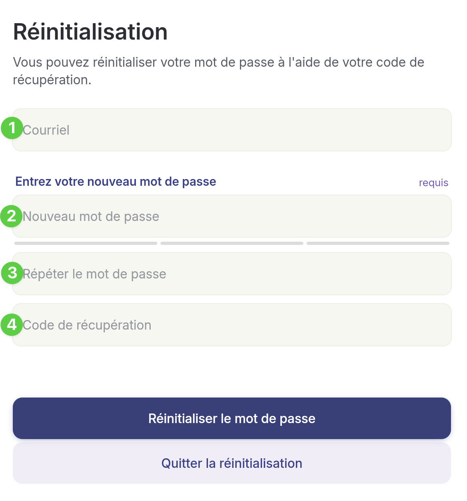
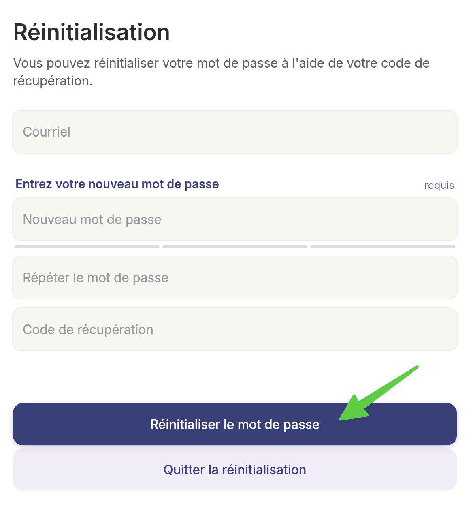

# Réinitialiser son mot de passe


Si vous avez oublié ou perdu votre mot de passe, vous pouvez le réinitialiser en utilisant la méthode ci-dessous.


## Pas-à-pas



**Lors de votre tentative de connexion, cliquez sur&#x20;**_**Mot de passe oublié?**_

<figure><figcaption></figcaption></figure>




**Remplissez les champs demandés:**

1. **Inscrivez le courriel relié à votre compte.**
2. **Inscrivez un nouveau mot de passe.**
3. **Validez votre mot de passe en le réécrivant une 2e fois.**
4. **Inscrivez votre code de récupération.\***

<figure><figcaption></figcaption></figure>


\*Le code de récupération vous a été transmis par courriel **à la création de votre compte**. Il est remplacé à chaque fois que vous réinitialisez votre mot de passe. Assurez-vous d'utiliser le plus récent.

**Vous pouvez le retrouver dans vos courriels en cherchant l'objet&#x20;**_**Code de récupération pour votre compte Braver**_**. Vérifiez vos indésirables!**





**Ensuite, sélectionnez&#x20;**_**Réinitialiser le mot de passe**_**.**

<figure><figcaption></figcaption></figure>



